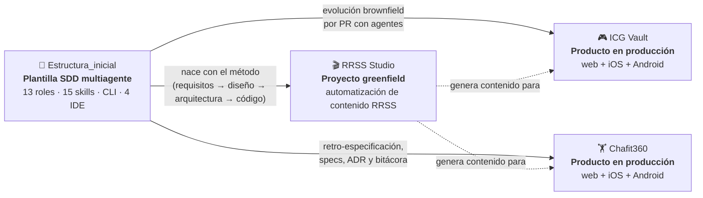

# De la especificación a producción

### Un ecosistema de desarrollo dirigido por especificaciones (SDD) con agentes de IA, aplicado a tres productos reales

**Trabajo de Fin de Máster** · Autor: Jesús Chamorro ([@jechamo](https://github.com/jechamo)) · Entrega: 2026

| | Enlace |
|---|---|
| 🎞️ **Slides** | [`slides/index.html`](slides/index.html) · publicado en GitHub Pages: `https://jechamo.github.io/TFM/` *(ver [despliegue de las slides](docs/03-despliegue.md#6-slides-del-tfm-github-pages))* |
| 🎬 **Vídeo** | `PENDIENTE: pegar aquí la URL de YouTube o Drive` · [guion del vídeo](docs/05-guion-video.md) |
| 🌐 **ICG Vault (producción)** | [icgvault.es](https://icgvault.es) · [App Store](https://apps.apple.com/es/app/icg-vault/id6759173751) · [Google Play](https://play.google.com/store/apps/details?id=com.icgvault.app) |
| 🏋️ **Chafit360 (producción)** | [chafit.es](https://chafit.es) · [App Store](https://apps.apple.com/app/chafit/id6759172876) · [Google Play](https://play.google.com/store/apps/details?id=com.chafit.app) |
| 🎬 **RRSS Studio** | [github.com/jechamo/rrss-automation-app](https://github.com/jechamo/rrss-automation-app) *(app local; ver [cómo ejecutarla](#3-instalación-y-ejecución))* |
| 🧱 **Plantilla SDD** | [github.com/jechamo/Estructura_inicial](https://github.com/jechamo/Estructura_inicial) |
| 🔑 **Usuario de prueba** | [Sección 6](#6-usuarios-y-contraseñas-de-prueba) |

---

## Índice

1. [Descripción general](#1-descripción-general)
2. [Stack tecnológico](#2-stack-tecnológico)
3. [Instalación y ejecución](#3-instalación-y-ejecución)
4. [Estructura del proyecto](#4-estructura-del-proyecto)
5. [Funcionalidades principales](#5-funcionalidades-principales)
6. [Usuarios y contraseñas de prueba](#6-usuarios-y-contraseñas-de-prueba)
7. [Despliegue](#7-despliegue)
8. [Repositorios y acceso](#8-repositorios-y-acceso)
9. [Resultados y métricas](#9-resultados-y-métricas)
10. [Documentación ampliada](#10-documentación-ampliada)

---

## 1. Descripción general

### El problema

Los asistentes de IA escriben código deprisa, pero sin método esa velocidad trae deuda técnica:
requisitos que se dan por supuestos, arquitectura que nadie ha decidido, pruebas que no existen
y cambios que nadie puede rastrear. En un proyecto personal da igual. En una aplicación con
usuarios reales, pagos y fichas en App Store y Google Play, no.

### La propuesta

Este TFM presenta un **ecosistema de ingeniería de software** en el que agentes de IA especializados
trabajan con **disciplina de equipo profesional**: especificación antes que código, decisiones de
arquitectura documentadas (ADR), TDD, seguridad desde el diseño y trazabilidad verificable de qué
agente hizo qué.

Se demuestra en **cuatro piezas conectadas**:



| Pieza | Qué es | Papel en el TFM |
|---|---|---|
| **[Estructura_inicial](docs/proyectos/01-estructura-inicial.md)** | Plantilla reutilizable de *Specification-Driven Development* con orquestador, 13 roles especialistas, 15 skills, 12 prompts, hooks de seguridad y una CLI en Python (`tools/sdd.py`) que genera adaptadores para Claude Code, Cursor, GitHub Copilot/VS Code y Google Antigravity. | **El núcleo**: el método convertido en herramienta. |
| **[RRSS Studio](docs/proyectos/02-rrss-studio.md)** | Aplicación web local (Next.js) que analiza una app web y genera contenido para redes sociales: dossier de negocio, competencia, leads, virales, guiones, vídeos con IA, montaje con FFmpeg y publicación asistida. | **El proyecto principal**, hecho desde cero con el método: 17 requisitos especificados, diseñados e implementados uno a uno. |
| **[ICG Vault](docs/proyectos/03-icg-vault.md)** | Red social gamificada para votar películas, series y videojuegos, con niveles, cofres, rankings, un juego de cartas por turnos, arena PvP y retos diarios. | **Caso brownfield en producción**: evolucionado por PR con agentes (96 PR, versión nativa 71). |
| **[Chafit360](docs/proyectos/04-chafit360.md)** | Plataforma de fitness para clientes, entrenadores y gimnasios: rutinas generadas con IA, ejecución guiada, nutrición, progreso y suscripciones. | **Caso brownfield en producción**: retro-especificado con 7 specs, ADR y bitácora de decisiones (versión 35). |

### Por qué es diferenciador

- **No es una app de ejemplo.** Dos de los productos tienen usuarios reales, dominio propio y ficha publicada en App Store y Google Play.
- **Cubre el ciclo completo.** Idea → requisitos → arquitectura → código → pruebas → despliegue web y móvil → operación (observabilidad, runbooks, rollback).
- **Funciona en greenfield y en brownfield.** El mismo método crea un proyecto nuevo (RRSS Studio) y pone orden en dos aplicaciones heredadas de un generador *low-code* (Lovable) sin romper las versiones móviles ya publicadas.
- **La IA se gobierna, no se sufre.** Cada tarea lleva un contrato de *handoff* con alcance, permisos y evidencias, y `sdd.py check --strict` rechaza una tarea terminada sin rastro verificable.

Más contexto (motivación, objetivos, metodología, conclusiones y trabajo futuro) en la
[memoria del TFM](docs/01-memoria.md).

---

## 2. Stack tecnológico

| Capa | Estructura_inicial | RRSS Studio | ICG Vault | Chafit360 |
|---|---|---|---|---|
| **Lenguaje** | Python 3.11+ (solo biblioteca estándar) | TypeScript | TypeScript | TypeScript |
| **Frontend** | — | Next.js 15 (App Router), React 19, Tailwind 4, React Flow, Zustand, React Query | React 18, Vite, Tailwind, shadcn/ui (Radix), Framer Motion, React Query | React 18, Vite, Tailwind, shadcn/ui (Radix), React Query |
| **Móvil** | — | — | Capacitor 8 (iOS + Android), login social con Google y Apple | Capacitor (iOS + Android), notificaciones locales |
| **Backend** | CLI `tools/sdd.py` | Route Handlers de Next.js + SSE | Supabase: Postgres, Auth, RLS, Storage, 33 Edge Functions (Deno) | Supabase: Postgres, Auth, RLS, PGMQ, Cron, 28 Edge Functions (Deno) |
| **Datos** | JSON/JSONL (bitácoras append-only) | SQLite + Prisma (11 modelos) | Postgres (136 migraciones) | Postgres (54 migraciones) |
| **IA** | Agentes de Claude Code, Cursor, Copilot y Antigravity | Claude Code CLI / Agent SDK, Gemini, fal.ai, HeyGen, ElevenLabs, Whisper local | OpenAI (texto e imagen: avatares, mascotas, objetos, quizzes) | OpenAI (rutinas, nutrición, análisis de fotos de comida, chat, transcripción de voz, imágenes de ejercicios) |
| **Integraciones** | MCP (política y registro) | Scrape Creators, GitHub, yt-dlp, FFmpeg, Playwright | IGDB, TMDB, HowLongToBeat, Metacritic, RSS de noticias y podcast | Stripe (suscripciones), Sentry, correo transaccional |
| **Calidad** | `unittest` (36 pruebas), CI "SDD guard" | Vitest, contratos con `node --test`, Playwright E2E sin red ni créditos, ESLint, `tsc` | ESLint, `tsc`, revisión por PR | Playwright E2E, test de contrato de credenciales, ESLint |
| **Despliegue** | Plantilla en GitHub | Local (`localhost`) con instalador guiado para Windows 11 | Vercel + Supabase + App Store + Google Play | Vercel + Supabase + App Store + Google Play |

Detalle de cada tecnología y por qué se eligió en [Arquitectura](docs/02-arquitectura.md).

---

## 3. Instalación y ejecución

Cada proyecto se instala por separado. Aquí va lo mínimo para arrancarlo; la guía completa está en
[Despliegue e instalación](docs/03-despliegue.md).

### 3.1 Estructura_inicial (plantilla SDD)

Requisitos: **Python 3.11+** y Git.

```bash
git clone https://github.com/jechamo/Estructura_inicial.git mi-proyecto
cd mi-proyecto
python tools/sdd.py init --name "Mi proyecto"      # inicializa la constitución y metadatos
python tools/sdd.py feature "Fundación del producto" # crea specs/001-*/
python tools/sdd.py sync                           # regenera adaptadores .claude/.cursor/.github
python tools/sdd.py check                          # valida la estructura SDD
python -m unittest discover -s tests -v            # 36 pruebas
```

Después abre el proyecto en tu IDE, elige el agente `sdd-orchestrator` y lanza
`/discover-and-specify` con tu idea o PRD.

### 3.2 RRSS Studio (proyecto principal)

Requisitos: **Windows 11**, **Node.js ≥ 20** y npm. Las herramientas opcionales (Claude Code
autenticado, FFmpeg, yt-dlp, Chromium de Playwright) amplían funciones, pero la app arranca sin ellas.

```bat
git clone https://github.com/jechamo/rrss-automation-app.git
cd rrss-automation-app
preparar.bat                    :: asistente guiado: diagnóstico → preparación → arranque
:: o bien, paso a paso:
npm run setup:local             :: diagnóstico, sin cambios
node scripts/install-local.mjs prepare
node scripts/install-local.mjs start
```

Abre `http://localhost:3000`. Las claves de proveedores se configuran en
`http://localhost:3000/ajustes` y se guardan cifradas (AES-256-GCM) en un Vault local, nunca en `.env`.

**Probarla sin claves ni créditos** (cualquier sistema operativo):

```bash
npm ci
npx playwright install chromium
npm run test:e2e:mock    # SQLite, Vault y proveedores simulados en un directorio temporal
```

### 3.3 ICG Vault y Chafit360

Ya están en producción, así que **para evaluarlos no hace falta instalar nada**: basta la web o la app
móvil ([sección 7](#7-despliegue)). Para desarrollo local:

```bash
git clone https://github.com/jechamo/<icgbolt|chafit360>.git
cd <repo>
npm ci
cp .env.example .env     # Chafit360; en ICG Vault crea .env con las mismas dos variables:
                         # VITE_SUPABASE_URL y VITE_SUPABASE_PUBLISHABLE_KEY de un proyecto Supabase
npm run dev              # http://localhost:8080
npm run build:mobile     # build web + sincronización con los proyectos nativos (Capacitor)
npx cap open ios         # o: npx cap open android
```

Las Edge Functions se despliegan con `supabase functions deploy <nombre>`. Sus secretos (OpenAI,
Stripe, IGDB, TMDB…) viven en los *secrets* de Supabase y no en el repositorio.

---

## 4. Estructura del proyecto

### 4.1 Este repositorio (entrega del TFM)

```text
TFM/
├── README.md                     ← este documento (documentación principal)
├── docs/
│   ├── 01-memoria.md             ← motivación, objetivos, metodología, conclusiones
│   ├── 02-arquitectura.md        ← arquitectura del ecosistema y de cada producto
│   ├── 03-despliegue.md          ← despliegue, instalación y URLs
│   ├── 04-metodologia-sdd.md     ← el circuito SDD, agentes, handoffs y quality gates
│   ├── 05-guion-video.md         ← guion del vídeo con tiempos y qué enseñar en pantalla
│   ├── 06-entrega.md             ← checklist del formulario y acceso a los repos privados
│   └── proyectos/
│       ├── 01-estructura-inicial.md
│       ├── 02-rrss-studio.md
│       ├── 03-icg-vault.md
│       └── 04-chafit360.md
├── slides/
│   ├── index.html                ← presentación (HTML autocontenido, se abre en cualquier navegador)
│   └── TFM-presentacion.pdf      ← la misma presentación en PDF
└── .github/workflows/pages.yml   ← publica las slides en GitHub Pages
```

### 4.2 Los repositorios de código

<details>
<summary><b>Estructura_inicial</b>: plantilla SDD</summary>

```text
.agents/            fuente de verdad neutral
  roles/            13 especialistas (orquestador, producto, requisitos, arquitecto, UX,
                    backend, frontend, datos, QA/TDD, seguridad, SRE, code review, release)
  skills/           15 procedimientos (sdd-project, sdd-feature, implement-with-tdd, model-threats…)
  rules/            invariantes: núcleo, SDD, arquitectura, calidad/seguridad, datos/UI/operación
  templates/        plantillas de spec, plan, tareas, ADR, amenazas
  prompt-catalog.json  12 prompts "/" portables
.claude/ .cursor/ .github/   adaptadores GENERADOS por `sdd.py sync` (no se editan a mano)
docs/               arquitectura, gobierno, calidad, seguridad, operación, investigación
specs/NNN-*/        spec viva por funcionalidad: spec, plan, tasks, clarifications.jsonl,
                    handoffs/, execution-log.jsonl, evidence.md
tools/sdd.py        CLI (≈2.800 líneas, solo stdlib) · tools/hooks/  hooks portables
tests/tools/        36 pruebas unitarias de la CLI, hooks y workflow de CI
```
</details>

<details>
<summary><b>RRSS Studio</b>: aplicación Next.js local</summary>

```text
docs/               01-requisitos · 02-diseño · 03-arquitectura · 04-bitácora · 05-skills
                    architecture/ (constitución, ADR) · specs/ · design/ · security/ · ops/
prisma/schema.prisma  Project, Dossier, Competencia, Leads, Virales, Run, ContentPiece,
                    MediaAsset, MixComposition, NavigationMap, ConnectorState
src/app/            páginas (dashboard, proyecto, clips, ajustes, guía) y 16 grupos de /api
src/components/     PipelineGraph (React Flow), ContentTray, MediaStudio, ClipLab, PublishModal…
src/core/           ai · pipeline · crawler · repo · dossier · competencia · leads · virales ·
                    content · media · clips · navigation · connectors · secrets · installation
e2e/                Playwright con proveedores simulados y egreso bloqueado
scripts/            instalador guiado, runner E2E, escáner de secretos, smoke tests
.agents/ .claude/   30 skills del ecosistema SDD + 3 skills de dominio RRSS
```
</details>

<details>
<summary><b>ICG Vault</b> y <b>Chafit360</b>: SPA + Capacitor + Supabase</summary>

```text
src/pages/          ICG Vault: 38 páginas · Chafit360: 25 páginas
src/components/     ICG Vault: 198 componentes · Chafit360: 145 componentes
src/integrations/   cliente Supabase y tipos generados
supabase/functions/ Edge Functions Deno (ICG Vault: 33 · Chafit360: 28)
supabase/migrations/  ICG Vault: 136 · Chafit360: 54
android/ ios/       proyectos nativos generados por Capacitor
docs/               Chafit360: constitución, ADR, 7 specs, bitácora, calidad, runbooks
                    ICG Vault: planes de rollback de pilotos (p. ej. ICG Duelo)
vercel.json         reescrituras SPA para el hosting en Vercel
```
</details>

---

## 5. Funcionalidades principales

### 🧱 Estructura_inicial: el método hecho herramienta

- **Orquestador + especialistas.** Un `sdd-orchestrator` decide qué roles intervienen y les delega con contratos de *handoff*.
- **Preguntas antes que suposiciones.** `sdd.py clarify` registra dudas `blocking`/`material`/`reversible`, y las materiales bloquean `work start` hasta que las resuelve una persona.
- **Trazabilidad verificable.** `work start`/`work complete` generan *handoffs* inmutables y una bitácora append-only con agente, skills, archivos, checks y evidencias. `check --strict` rechaza tareas "hechas" sin ese rastro.
- **Una definición, cuatro IDE.** `sdd.py sync` genera agentes, skills, prompts, hooks y reglas nativos para Claude Code, Cursor, GitHub Copilot/VS Code y Antigravity.
- **Hooks de seguridad.** Bloquean comandos destructivos y la edición de ficheros generados, y piden confirmación ante secretos, infraestructura o base de datos.
- **Arquitectura por ejes.** Playbook, catálogo de patrones y ADR en formato MADR. Por defecto, monolito modular.

### 🎬 RRSS Studio: del producto al contenido publicado

| Requisito | Funcionalidad |
|---|---|
| REQ-001 | **Dossier de negocio** a partir de una URL y su código (ruta local o GitHub público/privado). |
| REQ-002 | **Competencia**: descubrimiento híbrido IA + edición manual y tabla comparativa. |
| REQ-003 | **Leads**: negocios reales localizados con búsqueda web y una estrategia de captación por lead (correo, visita con guion…). |
| REQ-004 | **Virales**: top 20 del nicho en YouTube, TikTok e Instagram (viral = ≈5× la mediana del autor). |
| REQ-005 | **Contenido desde un viral**: guion → vídeo con fal.ai o avatar HeyGen → voz con ElevenLabs → montaje FFmpeg. |
| REQ-006 | **Contenido propio**: Playwright navega la app en modo móvil, graba la demo y la monta con B-roll y locución. |
| REQ-008 | **Ajustes** con Vault cifrado y botón «Probar conexión» por proveedor. |
| REQ-009 | **Pipeline visual** con nodos animados en tiempo real (React Flow + SSE). |
| REQ-010 | **Publicación asistida**: descargar, copiar el texto, abrir la red y marcar como publicado. |
| REQ-011/012 | **Estudio multimedia**: mediateca, grabación de pantalla, MIX y planificación de cortes con coste estimado antes de gastar créditos. |
| REQ-013 | **Preflight de prompts**: ningún prompt llega a fal.ai sin que el usuario lo vea, edite y apruebe. |
| REQ-014/015/016 | **Navegación autenticada** y **mapa funcional recursivo** de la app (tres niveles, con referencias `archivo:línea`). |
| REQ-018 | **Laboratorio de clips**: un vídeo largo o de YouTube se convierte en clips 9:16 subtitulados (virales y polémicos). |

### 🎮 ICG Vault: comunidad gamificada de cine, series y videojuegos

- Votar películas, series y videojuegos con datos de **TMDB, IGDB, HowLongToBeat y Metacritic**. El voto pesa más según el nivel del usuario.
- **Progresión RPG**: niveles, cofres, objetos, mascotas, guardianes y avatares generados con IA (familia `gpt-image`), con modelo y calidad configurables desde el panel de administración.
- **Juegos**: *ICG Duelo* (cartas por turnos, con mazo, sobres y *mulligan*), **Arena PvP**, **Inmortales** (temporadas con crónica), **Zoom Out** (reto diario con piloto automático), **FlashOut** y **Timeline**.
- **Comunidad**: feed, perfiles públicos, listas compartibles, rankings, lo mejor de la semana, debates, encuestas y quizzes semanales generados con IA, sugerencias votadas, noticias, podcast y calendario de estrenos.
- **Plataforma**: PWA, apps nativas con login de Google y Apple, *hub* de notificaciones, SEO y control de versión nativa mínima.

### 🏋️ Chafit360: entrenamiento integral con IA

- **Cuatro roles**: cliente, entrenador personal, gimnasio y superusuario.
- **Rutinas con IA** de gimnasio, calistenia, CrossFit, HIIT y circuitos, con un contrato estricto de 9 columnas validado con JSON Schema.
- **Ejecución guiada**: tarjetas deslizables tipo baraja, biseries, descansos, reanudación exacta, marcas de «cambiar ejercicio» y sustitución con IA.
- **Imágenes de ejercicios** con IA, incluida la versión generada desde una foto de la máquina del propio gimnasio, y miniaturas WebP servidas por una cola PGMQ y un worker programado con Cron.
- **Nutrición** (planes y análisis de fotos de comida), **análisis de progreso**, **chat asistente** y **transcripción de voz**.
- **Negocio**: suscripciones con Stripe (checkout y portal de cliente), códigos de gimnasio, mensajería y rankings.
- **Operación**: Sentry con consentimiento y sin PII, Web Vitals, runbooks de incidentes y regresiones, y despliegue en Vercel.

---

## 6. Usuarios y contraseñas de prueba

> RRSS Studio y la plantilla **no tienen login**. RRSS Studio es una aplicación local de un solo
> usuario (`127.0.0.1`), y su modo `npm run test:e2e:mock` permite recorrerla sin cuentas ni claves.

Para ICG Vault y Chafit360 se usan **cuentas de demostración exclusivas para la corrección**,
separadas de las cuentas reales y de las reservadas a la revisión de Google Play:

| Aplicación | Rol | Usuario | Contraseña |
|---|---|---|---|
| ICG Vault ([icgvault.es](https://icgvault.es)) | Usuario | `PENDIENTE` | `PENDIENTE` |
| Chafit360 ([chafit.es](https://chafit.es)) | Cliente | `PENDIENTE` | `PENDIENTE` |
| Chafit360 ([chafit.es](https://chafit.es)) | Entrenador | `PENDIENTE` | `PENDIENTE` |

> ⚠️ Las credenciales se rellenan en el momento de la entrega (ver [checklist](docs/06-entrega.md#2-cuentas-de-prueba)).
> Son cuentas desechables, sin datos personales y con permisos mínimos, que se desactivarán tras la corrección.

---

## 7. Despliegue

| Producto | Web | iOS | Android | Infraestructura |
|---|---|---|---|---|
| **ICG Vault** | [icgvault.es](https://icgvault.es) | [App Store](https://apps.apple.com/es/app/icg-vault/id6759173751) | [Google Play](https://play.google.com/store/apps/details?id=com.icgvault.app) | Vercel (SPA) · Supabase (DB, Auth, Storage, Edge Functions) · Capacitor |
| **Chafit360** | [chafit.es](https://chafit.es) | [App Store](https://apps.apple.com/app/chafit/id6759172876) | [Google Play](https://play.google.com/store/apps/details?id=com.chafit.app) | Vercel · Supabase · Stripe · Sentry · Capacitor |
| **RRSS Studio** | Local por diseño (`127.0.0.1:3000`) | — | — | Instalador guiado para Windows 11 · E2E en CI de Windows |
| **Estructura_inicial** | Plantilla en GitHub | — | — | CI "SDD guard" en GitHub Actions |
| **Slides del TFM** | GitHub Pages (`https://jechamo.github.io/TFM/`) | — | — | Workflow [`pages.yml`](.github/workflows/pages.yml) |

**¿Por qué RRSS Studio no está en la nube?** Es una decisión de arquitectura (D-01, ADR-0001), no una
carencia. La app lanza la CLI de Claude Code con la sesión local del usuario (sin coste de API),
controla un navegador con Playwright, procesa vídeo con FFmpeg y guarda en disco las claves cifradas
de siete proveedores de pago. Publicarla en internet expondría credenciales y créditos ajenos. Por eso
escucha solo en `127.0.0.1` y se distribuye con un instalador que verifica persistencia, arranque y
dependencias opcionales.

Detalle completo en [docs/03-despliegue.md](docs/03-despliegue.md).

---

## 8. Repositorios y acceso

| Repositorio | Visibilidad | Justificación |
|---|---|---|
| [jechamo/TFM](https://github.com/jechamo/TFM) | Público | Entrega del TFM: documentación, slides y enlaces. |
| [jechamo/rrss-automation-app](https://github.com/jechamo/rrss-automation-app) | Público | Proyecto principal. |
| [jechamo/Estructura_inicial](https://github.com/jechamo/Estructura_inicial) | Privado → **se recomienda hacerlo público** | Es una plantilla sin datos sensibles. |
| [jechamo/icgbolt](https://github.com/jechamo/icgbolt) | Privado · acceso concedido a `mouredev@gmail.com` | Producto comercial en producción con usuarios reales. Su historial contiene configuración de entornos productivos que no debe publicarse. |
| [jechamo/chafit360](https://github.com/jechamo/chafit360) | Privado · acceso concedido a `mouredev@gmail.com` | Producto comercial con suscripciones de pago (Stripe) y datos de salud. La propia bitácora del proyecto registra un `.env` versionado en el historial. |

---

## 9. Resultados y métricas

| Métrica | Estructura_inicial | RRSS Studio | ICG Vault | Chafit360 |
|---|---:|---:|---:|---:|
| Commits | 5 | 78 | 1.518 | 1.380 |
| Pull requests integradas | — | — | 96 | 34 |
| Líneas de TypeScript/Python | ≈2.800 (CLI) | ≈33.700 | ≈88.300 | ≈59.200 |
| Páginas / pantallas | — | 5 zonas + 16 grupos de API | 38 | 25 |
| Edge Functions | — | — | 33 | 28 |
| Migraciones de BD | — | Prisma (11 modelos) | 136 | 54 |
| Especificaciones SDD | 1 | 17 REQ + 2 specs | Planes de piloto y rollback | 7 specs + 2 ADR |
| Pruebas automáticas | 36 unitarias | 25 ficheros (UI + contratos) + E2E Playwright | lint + typecheck | E2E Playwright |
| Versión publicada | 2026.07.30.1 | 0.1.0 | 71.0.0 | 35.0.0 |

*Datos extraídos de los repositorios en septiembre de 2026.*

---

## 10. Documentación ampliada

| Documento | Contenido |
|---|---|
| [Memoria](docs/01-memoria.md) | Motivación, objetivos, metodología, retos, conclusiones y trabajo futuro. |
| [Arquitectura](docs/02-arquitectura.md) | Diagramas del ecosistema y de cada producto, decisiones y patrones. |
| [Despliegue](docs/03-despliegue.md) | Pipeline de despliegue web y móvil, instalación local y URLs. |
| [Metodología SDD](docs/04-metodologia-sdd.md) | Circuito SDD, agentes, *handoffs*, *quality gates* y trazabilidad. |
| [Guion del vídeo](docs/05-guion-video.md) | Estructura del vídeo, tiempos y qué enseñar en pantalla. |
| [Checklist de entrega](docs/06-entrega.md) | Campos del formulario, cuentas de prueba y permisos de repositorios. |
| Fichas de producto | [Estructura_inicial](docs/proyectos/01-estructura-inicial.md) · [RRSS Studio](docs/proyectos/02-rrss-studio.md) · [ICG Vault](docs/proyectos/03-icg-vault.md) · [Chafit360](docs/proyectos/04-chafit360.md) |

---

<sub>TFM · Máster en desarrollo de software · Jesús Chamorro · 2026</sub>
