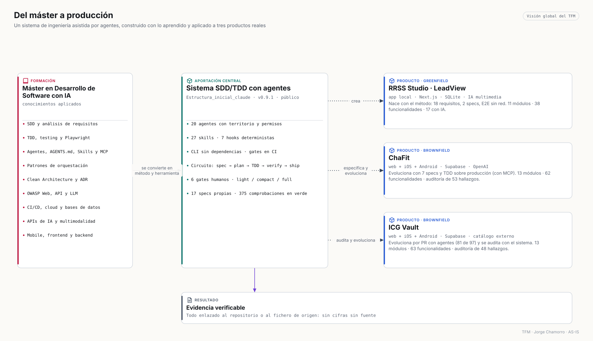
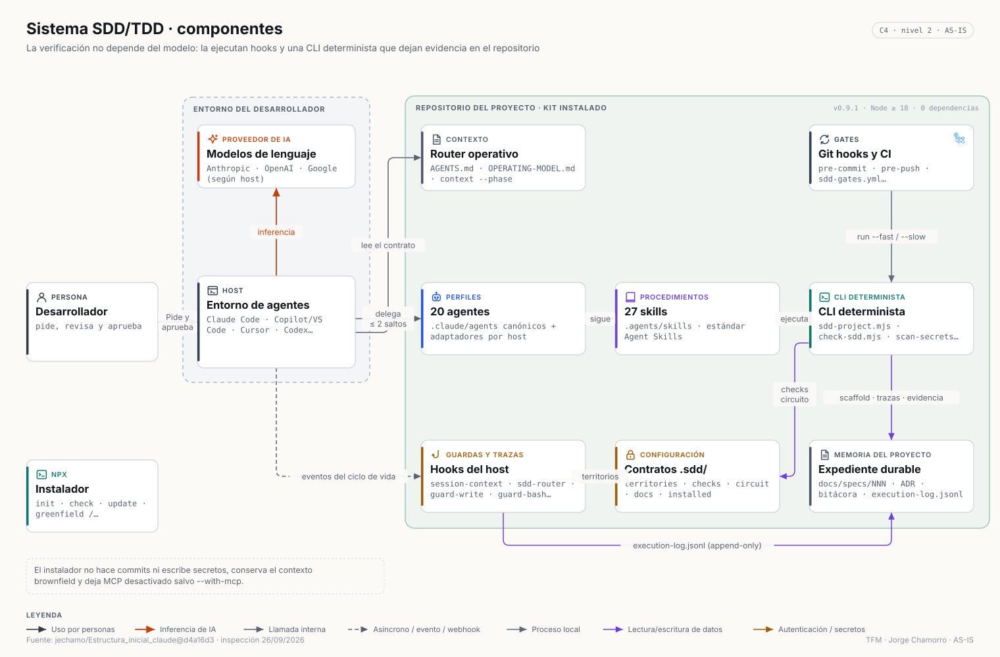
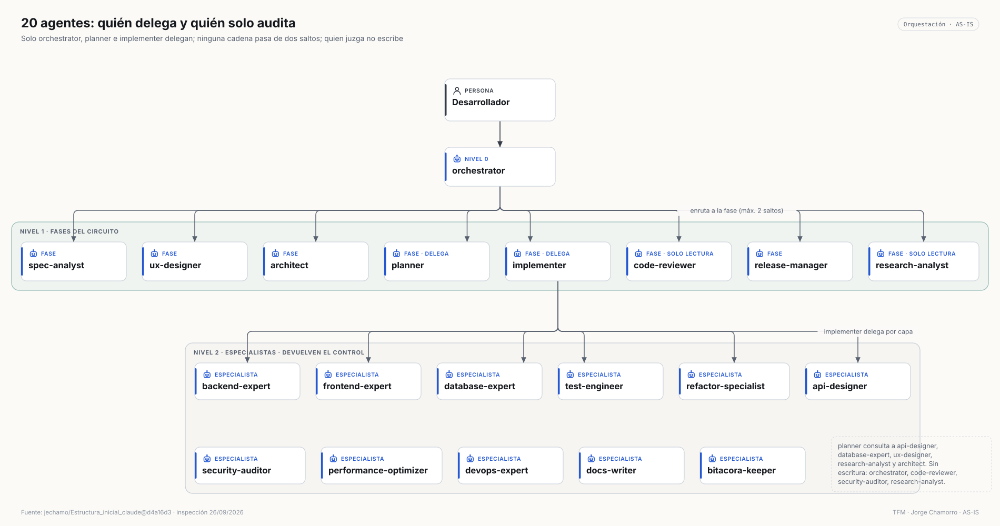
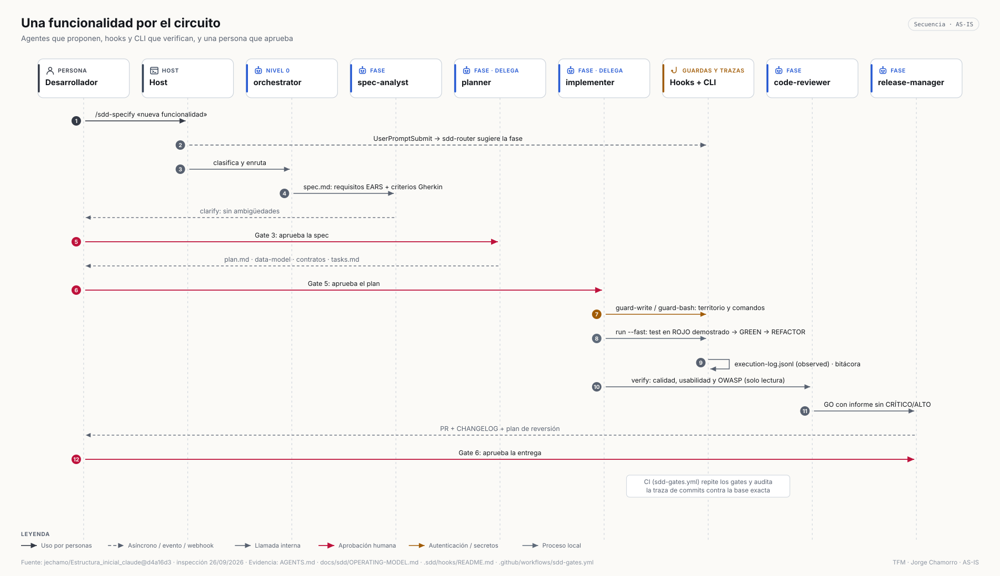
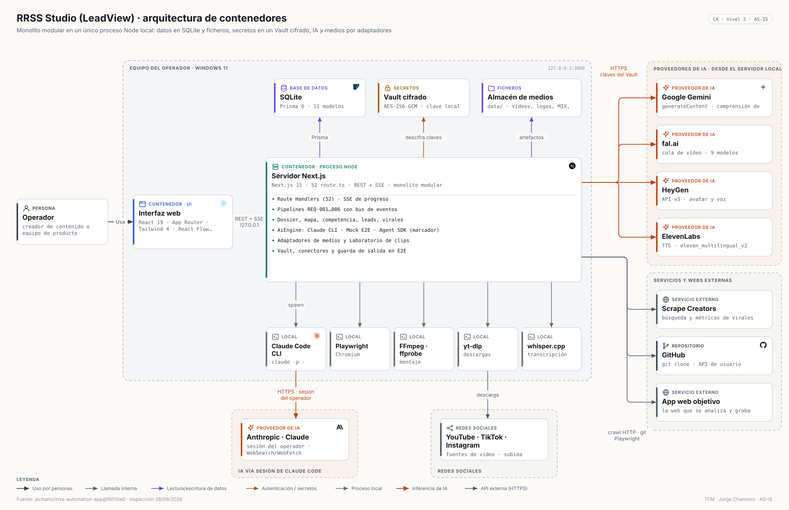
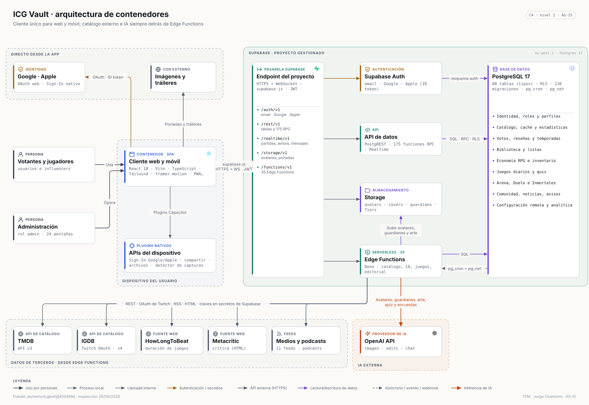

# Del máster a producción

**Ingeniería de software dirigida por especificaciones con agentes de IA, aplicada a tres productos reales.**

Trabajo de Fin de Máster · **Jorge Chamorro** ([@jechamo](https://github.com/jechamo)) · Máster en Desarrollo de Software con IA · 2026

| | |
|---|---|
| 🌐 **Web del TFM** | <https://jechamo.github.io/TFM/> |
| 🎞️ **Slides** | <https://jechamo.github.io/TFM/slides/> · [PDF](https://jechamo.github.io/TFM/slides/TFM-Jorge-Chamorro.pdf) |
| 🎬 **Vídeo (16:30)** | <https://jechamo.github.io/TFM/video.html?v=tfm-completo> · [resumen de 8 min](https://jechamo.github.io/TFM/video.html?v=tfm-resumen) |
| 🧱 **Sistema SDD/TDD** | [github.com/jechamo/Estructura_inicial_claude](https://github.com/jechamo/Estructura_inicial_claude) · [web](https://jechamo.github.io/Estructura_inicial_claude/) |
| 🎥 **RRSS Studio** | [github.com/jechamo/rrss-automation-app](https://github.com/jechamo/rrss-automation-app) (aplicación local) |
| 🏋️ **ChaFit** | [github.com/jechamo/chafit360](https://github.com/jechamo/chafit360) · [chafit.es](https://chafit.es) · [App Store](https://apps.apple.com/app/chafit/id6759172876) · [Google Play](https://play.google.com/store/apps/details?id=com.chafit.app) |
| 🎮 **ICG Vault** | [github.com/jechamo/icgbolt](https://github.com/jechamo/icgbolt) · [icgvault.es](https://icgvault.es) · [App Store](https://apps.apple.com/es/app/icg-vault/id6759173751) · [Google Play](https://play.google.com/store/apps/details?id=com.icgvault.app) |



---

## 1. Qué es

He diseñado y construido un **sistema de ingeniería de software asistido por agentes**: Spec Driven Development + TDD, 20 agentes con territorio y permisos, 27 skills, 7 hooks deterministas y una CLI sin dependencias con seis puntos de aprobación humana. Lo he usado para **crear, evolucionar y auditar** tres productos reales:

| Producto | Tipo | Qué demuestra | Módulos | Funcionalidades | Con IA | Integraciones |
|---|---|---|---:|---:|---:|---:|
| **RRSS Studio** | *greenfield*, local | el método completo y muchos proveedores de IA con control de coste | 11 | 38 | 17 | 11 |
| **ChaFit** | *brownfield*, web + iOS + Android | SDD/TDD sobre un producto en producción con pagos y datos de salud | 13 | 62 | 12 | 9 |
| **ICG Vault** | *brownfield*, web + iOS + Android | escala funcional, lógica en base de datos y auditoría como entrada a SDD | 13 | 63 | 4 | 12 |

Cada cifra sale de un inventario con fichero de origen ([criterio de recuento](docs/discovery/TFM_DISCOVERY_REPORT.md)).

## 2. El problema

Los agentes de código escriben deprisa, pero sin método **se autocertifican**, trabajan con **contratos implícitos**, no dejan **rastro** de sus decisiones y dejan la **seguridad para el final**. ChaFit e ICG Vault nacieron en un generador *low-code* y crecieron a base de chat: funcionaban, pero no eran mantenibles. En ChaFit, la IA devolvía rutinas de 7 u 8 columnas cuando la app esperaba 9, y había **317 filas desplazadas en producción**. → [Problema y objetivos](docs/02-problem-and-goals.md)

## 3. La solución

**La spec manda, el test demuestra y la persona decide.** Ningún código sin especificación aprobada; ningún "pasa" sin ejecución; la verificación la hacen hooks y scripts, no el modelo; y seis gates humanos (producto, arquitectura, spec, diseño, plan y entrega). Se instala con `npx` en cualquier repositorio y funciona con Claude Code, GitHub Copilot, Cursor, Codex, Gemini CLI y Antigravity.

## 4. SDD y TDD


- **Diez fases** con artefacto propio: intake, arquitectura, specify (EARS + Gherkin), clarify, design, plan, tasks, implement, verify y ship.
- **Tres niveles** según la ruta del cambio (*light*, *compact* y *full*), decididos por la CLI y nunca por el agente.
- **TDD con evidencia**: RED demostrado → GREEN → REFACTOR; los hooks registran la ejecución real y `trace-audit` la contrasta en CI.

→ [Metodología SDD](docs/04-sdd-methodology.md) · [TDD y calidad](docs/05-tdd-quality.md)

## 5. Arquitectura global



El sistema es un kit de ficheros (agentes, skills, hooks, plantillas y CLI) que se instala en el repositorio del producto y gobierna a los agentes del IDE. → [Arquitectura global](docs/03-global-architecture.md)

## 6. Agentes



20 agentes; **solo tres delegan** (orchestrator, planner e implementer), con profundidad máxima de dos saltos. **Quien juzga no escribe**: code-reviewer, security-auditor y research-analyst son de solo lectura. → [Sistema de agentes](docs/06-agentic-system.md)

## 7. Flujo de trabajo



`/sdd-specify` → spec-analyst → **Gate 3** → planner → **Gate 5** → implementer (TDD tarea a tarea, bajo `guard-write` y `guard-bash`) → code-reviewer + security-auditor → release-manager → **Gate 6**, y la CI repite los gates. → [Flujo de desarrollo](docs/07-development-workflow.md)

## 8. Proyectos reales

Los tres productos usan el sistema de forma distinta, y eso es lo que los hace útiles como caso de estudio: [comparativa](docs/case-studies/project-comparison.md).

### RRSS Studio · LeadView

App local que analiza un producto desde su URL y su código, estudia la competencia, encuentra clientes potenciales y produce vídeo vertical con IA, mostrando el coste antes de gastar. Nació con el método: 18 requisitos, 2 specs del kit y 9 recorridos E2E sin red.
→ [Caso de estudio](docs/case-studies/rrss.md) · [mapa funcional](docs/case-studies/rrss-functional-map.md) · [arquitectura](docs/architecture/rrss-architecture.md)

### ChaFit

Plataforma para clientes, entrenadores y gimnasios: rutinas y dietas con IA, ejecución guiada con calentamiento, la ilustración de tu propia máquina a partir de una foto, foto al plato, asistente, rankings, mapa de entrenadores y suscripciones. **7 specs con TDD sobre producción**, desplegadas con Supabase MCP.
→ [Caso de estudio](docs/case-studies/chafit.md) · [mapa funcional](docs/case-studies/chafit-functional-map.md) · [arquitectura](docs/architecture/chafit-architecture.md)

### ICG Vault

Red social para votar cine, series y videojuegos, donde el voto pesa más cuanto más nivel tienes; biblioteca, cofres, avatares y guardianes generados con IA, juegos diarios y competitivos, noticias y podcast. **81 de 97 PR desde ramas de agentes**, y una auditoría integral como puerta de entrada a SDD.
→ [Caso de estudio](docs/case-studies/icgvault.md) · [mapa funcional](docs/case-studies/icgvault-functional-map.md) · [arquitectura](docs/architecture/icgvault-architecture.md)

## 9. Arquitecturas

Modelo C4 como código en [`architecture/model/`](architecture/model/), del que se generan **56 vistas SVG** (contexto, contenedores, integraciones, despliegue y secuencias, en claro y oscuro), 12 diagramas interactivos con Archify y un workspace de Structurizr. → [Decisión de herramientas](docs/discovery/DIAGRAM_TOOLING_DECISION.md) · [cómo regenerarlo](architecture/README.md)

| RRSS Studio | ChaFit | ICG Vault |
|---|---|---|
|  |  |  |

## 10. Integraciones

**32 integraciones externas en tiempo de ejecución**, cada una con quién llama, para qué, qué datos se intercambian, protocolo y credencial. Ninguna clave de pago o de IA llega al cliente: viven en Edge Functions o en un Vault cifrado. → [Matriz de integraciones](docs/architecture/external-integrations.md)

## 11. IA

**33 funcionalidades invocan un modelo**: en RRSS, Claude Code CLI, Gemini, fal.ai, HeyGen, ElevenLabs y Whisper local; en ChaFit, OpenAI (texto, visión, imagen, edición, Whisper y Assistants), con JSON Schema estricto; en ICG Vault, OpenAI para imágenes y borradores editoriales. → [Inventario de IA](docs/architecture/ai-integrations.md)

## 12. Auditorías

El sistema también audita lo ya construido. El orchestrator coordinó a database-expert (MCP de solo lectura), security-auditor, code-reviewer y ux-designer, contrastó los hallazgos con la base real y produjo informe y plan: **ChaFit, 53 hallazgos (15 críticos)** e **ICG Vault, 48 (16 críticos)**, el 23/09/2026. **Las correcciones todavía no se han aplicado**: el plan está pendiente del gate humano. Solo se publican resúmenes saneados. → [Metodología](docs/audits/audit-methodology.md) · [ChaFit](docs/audits/chafit-audit-summary.md) · [ICG Vault](docs/audits/icgvault-audit-summary.md)

## 13. Stack

| | RRSS Studio | ChaFit | ICG Vault |
|---|---|---|---|
| Frontend | React 19 · Next.js 15 · React Flow | React 18 · Vite · shadcn/ui | React 18 · Vite · framer-motion |
| Backend | 52 Route Handlers en un proceso Node | 28 Edge Functions (Deno) | 35 Edge Functions + 175 RPC en SQL |
| Datos | SQLite + Prisma | Postgres 17 (47 tablas) | Postgres 17 (88 tablas) |
| Mobile | — | Capacitor 8 (iOS + Android) | Capacitor 8 (iOS + Android) |
| Despliegue | local (Windows 11) | Vercel + Supabase | Vercel + Supabase |

Sistema SDD: Node.js ≥ 18 sin dependencias de runtime, Markdown (agentes y skills), JSON (hooks) y GitHub Actions.

## 14. Calidad

Ejecutado el 26/09/2026: **375** comprobaciones del sistema SDD; **71 + 138** tests en RRSS; **109 + 100** en ChaFit. ICG Vault no tiene tests todavía, y es el primer paso de su plan. La cobertura del sistema usa un trinquete (hoy 48,3 %) que solo puede subir. → [TDD y calidad](docs/05-tdd-quality.md) · [evidencias de implementación](docs/evidence/implementation-evidence.md)

## 15. Seguridad

Impacto de seguridad declarado en cada spec; OWASP Web 2025, API 2023, LLM 2025 y ASVS 5.0 dentro del circuito; ningún agente lee ni escribe secretos; MCP desactivado por defecto. → [Seguridad](docs/security/security.md)

## 16. Relación con el máster

**46 de 54 competencias aplicadas con evidencia**, 5 parciales y 3 no aplicadas, declaradas como tales. → [Matriz de evidencias](docs/evidence/master-evidence-matrix.md)

## 17. Instalación

```bash
npx --yes github:jechamo/Estructura_inicial_claude#v0.9.1 init ./mi-proyecto --mode auto --dry-run
```

RRSS Studio se ejecuta en local; ChaFit e ICG Vault se evalúan en producción. → [Instalación](docs/delivery/installation.md)

## 18. Demos

La [guía de demo](docs/delivery/demo-guide.md) propone un recorrido de 10 a 15 minutos por el sistema y los tres productos. Los vídeos, con capítulos y subtítulos, están en la [web del TFM](https://jechamo.github.io/TFM/#videos):

| Vídeo | Duración |
|---|---|
| [TFM completo: sistema + RRSS + ChaFit + ICG Vault](https://jechamo.github.io/TFM/video.html?v=tfm-completo) | 16:30 |
| [Resumen](https://jechamo.github.io/TFM/video.html?v=tfm-resumen) | 8:08 |
| [Sistema SDD/TDD](https://jechamo.github.io/TFM/video.html?v=sdd) · [RRSS](https://jechamo.github.io/TFM/video.html?v=rrss-4min) · [ChaFit](https://jechamo.github.io/TFM/video.html?v=chafit-4min) · [ICG Vault](https://jechamo.github.io/TFM/video.html?v=icg-vault-4min) | 4–5 min cada uno |

La narración de los vídeos es sintética.

## 19. Credenciales de demo

ChaFit e ICG Vault tienen login; las cuentas de demo también están en la [slide 2](https://jechamo.github.io/TFM/slides/#2).

| App | Web | Usuario | Contraseña |
|---|---|---|---|
| ChaFit | [chafit.es](https://chafit.es) | `client3@demo.chafit.es` | `demo123456` |
| ICG Vault | [icgvault.es](https://icgvault.es) | `Pepis` | `demo123456` |

RRSS Studio (app local) y el sistema SDD (kit instalable) no tienen login.

Son cuentas sin rol de administrador y su contraseña se cambiará después de la defensa. → [criterio](docs/security/security.md#credenciales-demo-criterio)

## 20. Repositorios

| Repositorio | Contenido |
|---|---|
| [jechamo/TFM](https://github.com/jechamo/TFM) | esta entrega: documentación, arquitectura como código, web, slides y pipeline de vídeo |
| [jechamo/Estructura_inicial_claude](https://github.com/jechamo/Estructura_inicial_claude) | sistema SDD/TDD (v0.9.1) |
| [jechamo/rrss-automation-app](https://github.com/jechamo/rrss-automation-app) | RRSS Studio · LeadView |
| [jechamo/chafit360](https://github.com/jechamo/chafit360) | ChaFit |
| [jechamo/icgbolt](https://github.com/jechamo/icgbolt) | ICG Vault |

## 21. Documentación

| | |
|---|---|
| Visión y método | [01 Visión](docs/01-overview.md) · [02 Problema](docs/02-problem-and-goals.md) · [03 Arquitectura global](docs/03-global-architecture.md) · [04 SDD](docs/04-sdd-methodology.md) · [05 TDD](docs/05-tdd-quality.md) · [06 Agentes](docs/06-agentic-system.md) · [07 Flujo](docs/07-development-workflow.md) |
| Descubrimiento | [informe](docs/discovery/TFM_DISCOVERY_REPORT.md) e inventarios funcionales, de arquitectura e integraciones en [`docs/discovery/`](docs/discovery/) |
| Entrega | [limitaciones](docs/delivery/limitations.md) · [lecciones aprendidas](docs/delivery/lessons-learned.md) · [checklist](docs/delivery/submission-checklist.md) · [estado](TFM_DELIVERY_STATUS.md) · [guion del vídeo](VIDEO_SCRIPT.md) |

## Estructura del repositorio

```text
README.md                 puerta de entrada
docs/                     documentación del TFM (visión, método, arquitectura, casos, auditorías, evidencias, entrega)
architecture/             modelo C4 como código, generadores y vistas exportadas (SVG, PNG, HTML, Structurizr)
site/                     web del TFM, reproductor de vídeo y slides (GitHub Pages)
tools/                    build de la web, capturas, catálogo de vídeos y export de slides
tfm-video/                pipeline de postproducción de los vídeos
media/                    vídeos (fuera de git; publicados como GitHub Release)
```

## Autor

**Jorge Chamorro** · [@jechamo](https://github.com/jechamo)
