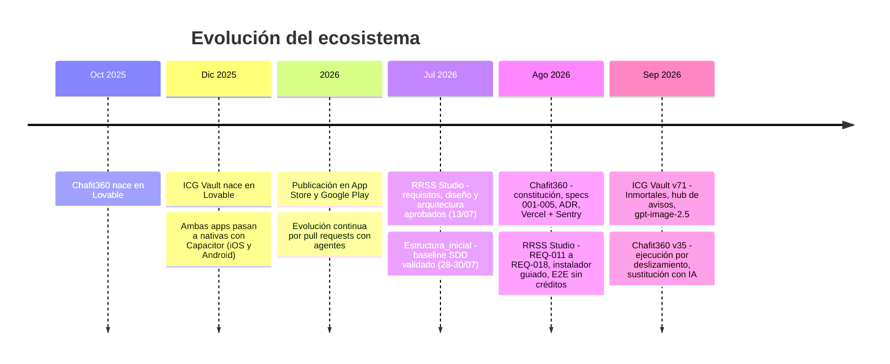

# Memoria del TFM

> **De la especificación a producción**: un ecosistema de desarrollo dirigido por especificaciones
> (SDD) con agentes de IA, aplicado a tres productos reales.

---

## 1. Motivación

Durante el máster la forma de programar ha cambiado mucho. Los asistentes de IA ya generan pantallas,
funciones y migraciones enteras en minutos. Eso tiene una trampa: **generar código ya no es el cuello
de botella, entenderlo y gobernarlo sí**.

Tenía dos aplicaciones nacidas en un generador *low-code* (Lovable) que habían crecido hasta tener
usuarios reales, pagos y fichas en App Store y Google Play: **ICG Vault** y **Chafit360**. Crecían
deprisa, pero cada cambio con IA era una apuesta. Nadie había fijado los requisitos, las decisiones de
arquitectura no estaban escritas y un error en una migración o una política RLS podía romper una
versión móvil publicada que no se actualiza al instante.

La pregunta del TFM fue:

> **¿Se puede trabajar con agentes de IA con la disciplina de un equipo profesional, de forma que la
> velocidad no se pague en deuda técnica, y demostrarlo en productos reales?**

## 2. Objetivos

### Objetivo general

Diseñar, construir y validar en producción un ecosistema de ingeniería de software en el que agentes de
IA especializados trabajen siguiendo *Specification-Driven Development*, con trazabilidad verificable
desde el requisito hasta el despliegue.

### Objetivos específicos

| # | Objetivo | Cómo se demuestra |
|---|---|---|
| O1 | Convertir la metodología en una **herramienta reutilizable** e independiente del IDE. | [Estructura_inicial](proyectos/01-estructura-inicial.md): 13 roles, 15 skills, CLI con 36 pruebas y adaptadores para 4 IDE. |
| O2 | Construir **desde cero** un producto complejo con el método. | [RRSS Studio](proyectos/02-rrss-studio.md): 17 requisitos especificados, diseñados e implementados uno a uno. |
| O3 | Aplicar el método a **código heredado en producción** sin romperlo. | [ICG Vault](proyectos/03-icg-vault.md) y [Chafit360](proyectos/04-chafit360.md): retro-especificación, ADR, specs y bitácora. |
| O4 | Cubrir el **ciclo completo** hasta el usuario final: web, iOS y Android. | icgvault.es, chafit.es y sus apps en las dos tiendas. |
| O5 | Integrar **IA generativa como funcionalidad** de producto, no solo como herramienta de desarrollo. | Rutinas, nutrición e imágenes en Chafit360. Avatares y quizzes en ICG Vault. Dossier, guiones, vídeo y voz en RRSS Studio. |
| O6 | Tratar **seguridad, calidad y operación** como requisitos de primer nivel. | Vault AES-256-GCM, RLS, hooks, E2E sin red, Sentry con consentimiento, runbooks y planes de rollback. |

## 3. Metodología

### 3.1 Specification-Driven Development

El trabajo sigue un circuito inspirado en GitHub Spec Kit y ampliado con arquitectura, seguridad y
gobierno:

```text
Constitución
  → Especificar → Aclarar → Planificar → Listas de control
  → Descomponer en tareas → Analizar coherencia
  → TDD: rojo → verde → refactorizar
  → Converger especificación, código y evidencias
  → Revisar seguridad/calidad → ADR/bitácora → Entregar
```

La especificación fija el **qué** y el **porqué** antes que el **cómo**. El detalle está en
[Metodología SDD](04-metodologia-sdd.md).

### 3.2 Agentes como equipo

En lugar de un único asistente "que lo hace todo", el trabajo se reparte entre **roles especialistas**
(producto, requisitos, arquitectura, UX, backend, frontend, datos, QA/TDD, seguridad, SRE, revisión de
código y release) coordinados por un **orquestador**. Cada delegación lleva un contrato de *handoff*
con el objetivo, lo que entra y lo que no, los permisos, los criterios de aceptación y las evidencias
exigidas.

### 3.3 Dos escenarios

| Escenario | Proyecto | Estrategia |
|---|---|---|
| **Greenfield** | RRSS Studio | Requisitos → Diseño → Arquitectura → Código, **requisito a requisito**, validando cada uno antes del siguiente. |
| **Brownfield** | ICG Vault, Chafit360 | *Onboarding* del estado actual (lo observado frente a lo inferido), constitución, **retro-especificación** de cada cambio relevante, ADR y bitácora. Cambios siempre **compatibles hacia atrás** con las apps móviles ya publicadas. |

## 4. Desarrollo

### 4.1 Cronología



### 4.2 Retos principales y cómo se resolvieron

| Reto | Solución |
|---|---|
| **Los agentes "dicen" que hicieron algo, pero no hay prueba.** | Bitácora append-only (`execution-log.jsonl`), *handoffs* inmutables y hooks `SubagentStart`/`SubagentStop`. `check --strict` rechaza una tarea `done` sin ejecución coherente. |
| **Cada IDE tiene su formato de agentes y skills.** | Fuente neutral en `.agents/` y generador `sdd.py sync` para Claude Code, Cursor, Copilot/VS Code y Antigravity. |
| **Usar IA de forma intensiva sin pagar API** (RRSS Studio). | Motor `AiEngine` intercambiable que llama a la CLI de Claude Code en modo *headless* con la sesión del usuario. Gemini queda solo para comprensión de vídeo. |
| **Gastar créditos de vídeo por error.** | Plan audiovisual con coste estimado antes de generar (REQ-012) y *preflight* obligatorio de prompts (REQ-013). El servidor rechaza creaciones sin revisión. |
| **Probar integraciones de pago sin gastar.** | Perfil `RRSS_E2E_MODE=mock`: fakes de los ocho proveedores, bloqueo de todo host que no sea *loopback* y datos en un directorio temporal. |
| **HTML libre generado por IA que rompía tablas** (Chafit360). | Contrato canónico de 9 columnas con JSON Schema estricto (spec 001), compatible con las apps publicadas. |
| **Miniaturas de 1024 px servidas como "miniatura".** | Pipeline durable: WebP 256×256, cola PGMQ, worker con Cron y resolvedor por lotes (spec 002). |
| **Migrar de hosting sin reabrir problemas de RLS.** | Vercel + Sentry sin ninguna migración SQL, comparando por hash políticas, grants y *helpers* antes y después (spec 003, ADR-0002). |
| **Pilotos arriesgados en producción** (ICG Duelo). | Todo aditivo y aislado, con un plan de rollback documentado para frontend, SQL y funciones. |

## 5. Resultados

- **Cuatro repositorios** con más de **2.980 commits** y **130 pull requests** integradas en los productos en producción.
- **Dos productos publicados** en web, App Store y Google Play, con versiones nativas **71** (ICG Vault) y **35** (Chafit360).
- **Unas 180.000 líneas** de TypeScript/Python entre los cuatro proyectos.
- **61 Edge Functions** y **190 migraciones** de base de datos.
- **Una plantilla SDD** probada (36 pruebas en verde) y reutilizable en cualquier proyecto nuevo.
- **Trazabilidad**: 17 requisitos en RRSS Studio y 7 specs en Chafit360 con diseño, plan, pruebas y evidencias.

Las métricas por proyecto están en el [README](../README.md#9-resultados-y-métricas).

## 6. Conclusiones

1. **La especificación es la interfaz con la IA.** Cuanto más claro el requisito, menos iteraciones y menos regresiones. Las preguntas `material` sin resolver son el mejor indicador de que aún no toca programar.
2. **Brownfield pide humildad.** En producción, la primera tarea no es "mejorar" sino **observar y documentar** (`CURRENT-STATE.md`), separando lo observado de lo inferido. Toda deuda aceptada queda escrita.
3. **Las apps móviles publicadas son un contrato.** No se pueden forzar actualizaciones, así que cualquier cambio de API, esquema o respuesta debe ser aditivo y retrocompatible.
4. **La IA como funcionalidad exige control de coste y de calidad.** Planes previos, *preflight*, cupos, modelos configurables desde el panel de administración y validación con esquemas.
5. **La trazabilidad tiene que ser verificable, no narrativa.** Que un agente diga que ha terminado no demuestra nada; lo demuestran los checks, las evidencias y los eventos observados.

## 7. Trabajo futuro

- Hacer pública la plantilla y publicarla como *template repository* con documentación en inglés.
- Llevar a ICG Vault el circuito SDD completo (constitución, specs y ADR) que ya tiene Chafit360.
- Spec de endurecimiento de RLS en Chafit360 (la deuda aceptada está registrada en la bitácora).
- Publicación automática con las APIs oficiales de las redes en RRSS Studio (hoy asistida, por decisión D-06).
- Versión de RRSS Studio para macOS/Linux (el instalador actual está limitado a Windows 11).
- Pruebas unitarias en los parsers de los productos brownfield, que hoy dependen sobre todo de E2E.
