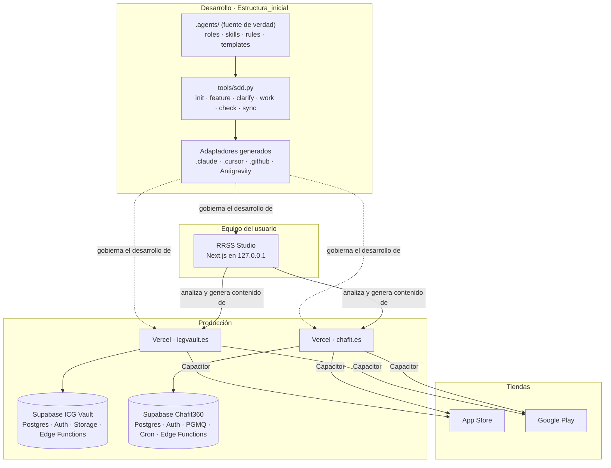
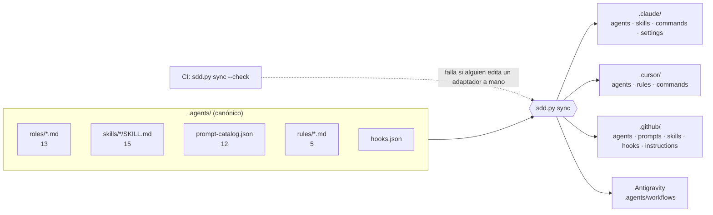
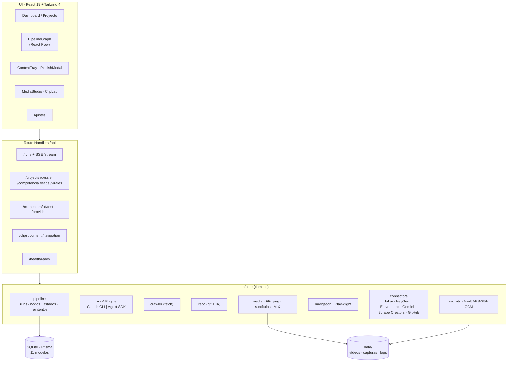
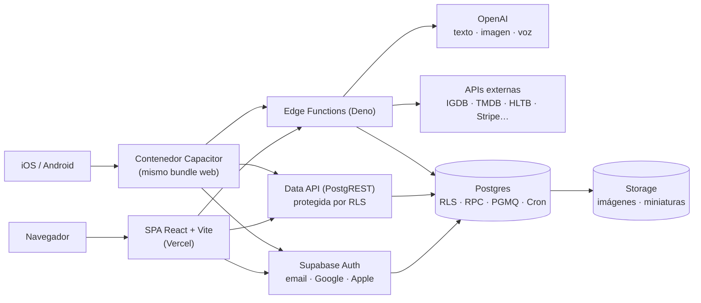

# Arquitectura

## 1. Visión de conjunto

## 2. Estructura_inicial: arquitectura de la plantilla

**Patrón:** fuente única canónica con generación de adaptadores, parecido a un compilador con varios
*backends*.

**Decisiones clave:**

- **Topología jerárquica híbrida.** El orquestador es responsable del resultado y los especialistas tienen iniciativa dentro de un *handoff* acotado. La profundidad máxima portable es 2 y los revisores son independientes.
- **Perfiles de capacidad en lugar de modelos concretos.** Los *handoffs* piden `fast`, `balanced`, `deep` o `inherit`, y cada host lo traduce al modelo que tenga disponible.
- **Solo biblioteca estándar de Python.** Sin dependencias, así que no hay riesgo de *supply chain* en la herramienta que controla la seguridad del resto.
- **Arquitectura por ejes.** Clean/hexagonal (dependencias internas), monolito/distribuido (despliegue) y DDD/vertical slices (límites) se combinan en lugar de excluirse. El valor por defecto es el **monolito modular**.

## 3. RRSS Studio: monolito modular local

**ADR-0001**: monolito modular local. **Stack:** Next.js 15 (App Router) + TypeScript + SQLite/Prisma.

**Patrones y decisiones destacables:**

| Patrón | Dónde | Por qué |
|---|---|---|
| **Strategy / puerto-adaptador** | `AiEngine` (CLI o Agent SDK), conectores y montaje (FFmpeg o cloud) | Proveedores intercambiables sin tocar el dominio. Cada conector expone `test()` para el botón «Probar conexión». |
| **Pipeline con estado persistido** | `core/pipeline` + modelo `Run` | Reintentos, historial y reanudación. El cliente se reconecta por SSE y recupera el estado desde la BD. |
| **Server-Sent Events** | `/api/runs/:id/stream` | Nodos animados en tiempo real con menos complejidad que WebSockets. |
| **Multiproyecto desde el inicio** | Todo cuelga de `Project` (D-14) | Pasar de una a varias apps no exige migración. |
| **Secret Vault** | `core/secrets` | Claves cifradas en reposo, escritura atómica y versionada, y lock de proceso. Nunca en `.env`. |
| **Aprobación humana antes del coste** | REQ-012/013 | Plan de cortes con coste estimado y *preflight* de prompts obligatorio, validados también en el servidor. |
| **Readiness real** | `/api/health/ready` | «Arrancado» significa que la aplicación, SQLite y el Vault responden, no solo que el puerto está ocupado. |

## 4. ICG Vault y Chafit360: SPA + BaaS + contenedor nativo

Los dos productos comparten arquitectura.

**Decisiones clave:**

- **Un solo código para web, iOS y Android** con Capacitor. Coste de mantenimiento mínimo para un único desarrollador.
- **La seguridad vive en la base de datos (RLS).** El cliente usa la clave publicable y la autorización real se aplica en Postgres. Las operaciones privilegiadas (IA, pagos, generación de imágenes) van por Edge Functions con `service_role`.
- **Compatibilidad hacia atrás obligatoria.** Las apps publicadas no se actualizan al instante, así que columnas nuevas *nullable*, respuestas HTTP estables y tablas laterales en vez de romper contratos. Ejemplo: variantes con mancuernas en Chafit360, que no caben como una décima columna del HTML de rutinas.
- **Control de versión nativa.** ICG Vault incluye `NativeVersionGate` para exigir una versión mínima cuando un cambio lo hace inevitable.
- **Procesos durables en el servidor.** Chafit360 usa colas PGMQ con workers programados con Cron para las miniaturas, e ICG Vault un piloto automático diario para Zoom Out, así nada depende de que el navegador siga abierto.

### Decisiones registradas (ADR) en Chafit360

| ADR | Decisión |
|---|---|
| ADR-0001 | Documentar la arquitectura heredada (monolito frontend organizado por tipo) antes de cambiarla. |
| ADR-0002 | Migrar hosting a Vercel y añadir Sentry **sin cambiar la autorización** (cero migraciones SQL y RLS comparada por hash). |

## 5. Seguridad transversal

| Riesgo | Mitigación |
|---|---|
| Secretos en el repositorio | Hooks que piden confirmación ante secretos, `scan-secrets.mjs` en RRSS Studio, Vault cifrado y secretos de Supabase fuera del bundle (`VITE_*` solo para valores públicos). |
| Acciones destructivas de agentes | Hooks que bloquean comandos destructivos y la edición de ficheros generados. Confirmación explícita ante BD e infraestructura. |
| Exposición de la app local | RRSS Studio escucha solo en `127.0.0.1`. El E2E bloquea cualquier host que no sea *loopback*. |
| Contraseñas de apps analizadas | Registro cifrado aparte y nunca incluido en prompts, respuestas ni logs (REQ-014). |
| PII en telemetría | Sentry sin PII. Trazas y Replay solo con consentimiento revocable (spec 003). |
| Supply chain | Acciones de GitHub fijadas por SHA, `overrides` de dependencias, `npm audit` como gate y skills externas en cuarentena hasta revisarlas. |
