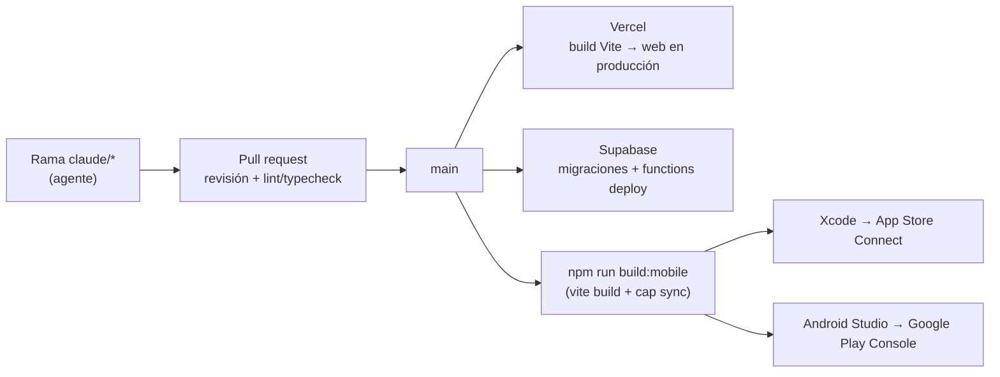
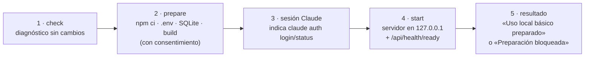

# Despliegue e instalación

## 1. Resumen de accesos

| Producto | Acceso | Estado |
|---|---|---|
| ICG Vault · web | <https://icgvault.es> | Producción |
| ICG Vault · iOS | <https://apps.apple.com/es/app/icg-vault/id6759173751> | Publicada (v71) |
| ICG Vault · Android | <https://play.google.com/store/apps/details?id=com.icgvault.app> | Publicada (v71) |
| Chafit360 · web | <https://chafit.es> | Producción |
| Chafit360 · iOS | <https://apps.apple.com/app/chafit/id6759172876> | Publicada (v35) |
| Chafit360 · Android | <https://play.google.com/store/apps/details?id=com.chafit.app> | Publicada (v35) |
| RRSS Studio | Local (`http://localhost:3000`) | Instalador guiado para Windows 11 |
| Estructura_inicial | Plantilla en GitHub | CI "SDD guard" |
| Slides del TFM | `https://jechamo.github.io/TFM/` | GitHub Pages (ver §6) |

## 2. Pipeline de despliegue de ICG Vault y Chafit360



1. **Web (Vercel).** Cada merge a `main` compila con Vite y publica. `vercel.json` reescribe todas las rutas a `index.html` para que el enrutado de la SPA funcione en cualquier URL.
2. **Backend (Supabase).**
   - Migraciones: `supabase db push` (o aplicadas por MCP con revisión previa).
   - Funciones: `supabase functions deploy <nombre>`.
   - Secretos: `supabase secrets set OPENAI_API_KEY=… STRIPE_SECRET_KEY=…`. Nunca en el repositorio ni en el bundle.
3. **Móvil (Capacitor).**
   ```bash
   npm run build:mobile      # vite build && npx cap sync
   npx cap open ios          # Archive → App Store Connect → revisión de Apple
   npx cap open android      # Generate Signed Bundle (.aab) → Google Play Console
   ```
   Cada release nativa sube la versión en iOS y Android a la vez; el historial está en los commits «Subir versión nativa a N.0.0».
4. **Compatibilidad.** Antes de desplegar backend se comprueba que las versiones nativas publicadas siguen funcionando: cambios aditivos, columnas *nullable* y respuestas estables.
5. **Observabilidad (Chafit360).** Sentry con *source maps* subidos en el build y runbooks en `docs/ops/runbooks/` para errores críticos, regresiones de release y degradación de Web Vitals.

### Variables de entorno públicas (frontend)

| Variable | Uso |
|---|---|
| `VITE_SUPABASE_URL` | URL del proyecto Supabase |
| `VITE_SUPABASE_PUBLISHABLE_KEY` | Clave publicable (segura en el cliente gracias a RLS) |
| `VITE_SENTRY_DSN` | Chafit360: DSN de Sentry |
| `VITE_PUBLIC_APP_URL` | Chafit360: origen canónico (`https://chafit.es`) para enlaces de correo y retorno de Stripe |

## 3. RRSS Studio: instalación local

**Por qué es local:** decisión D-01 / ADR-0001. Usa la sesión de Claude Code del usuario sin coste de
API, Playwright, FFmpeg, Whisper y ficheros locales, y custodia claves de proveedores de pago. Por eso
escucha solo en `127.0.0.1`.

### 3.1 Instalador guiado (Windows 11)

Doble clic en **`preparar.bat`** (equivale a `npm run setup:guide`):



| Comando | Efecto |
|---|---|
| `npm run setup:local` | Diagnóstico: plataforma, Node ≥ 20, dependencias, `.env`, SQLite, puerto y opcionales. |
| `node scripts/install-local.mjs prepare [--yes]` | Instala dependencias, prepara SQLite y exige `npm run build` en verde. |
| `node scripts/install-local.mjs start` | Arranca en producción limitado a `127.0.0.1`, con consentimiento. |
| `node scripts/install-local.mjs reset` | Copia de seguridad y reinicio de la persistencia, con doble confirmación. |

Garantías: no instala nada global, no modifica el `PATH`, no pide ni muestra secretos y nunca mata
procesos por nombre de imagen.

### 3.2 Herramientas opcionales

| Herramienta | Habilita | Instalación |
|---|---|---|
| Claude Code CLI | Dossier, análisis, guiones y planificación | Incluida como dependencia; `claude auth login` |
| FFmpeg + ffprobe | Montaje, subtítulos, MIX y clips | `winget install Gyan.FFmpeg` |
| yt-dlp | YouTube, TikTok e Instagram como fuente | `winget install yt-dlp.yt-dlp` |
| Chromium de Playwright | Login, navegación y grabación | `npx playwright install chromium` |
| Whisper local | Transcripción sin créditos | `whisper.cpp` en `data/tools/whisper-cpp` |

### 3.3 Demostración sin claves ni créditos

```bash
npm ci
npx playwright install chromium
npm run test:e2e:mock        # o npm run test:e2e:mock:ui para verlo en modo interactivo
```

Crea SQLite, Vault, sesiones y medios temporales en `.e2e-runtime/` y simula Claude, Gemini, fal.ai,
HeyGen, ElevenLabs, Scrape Creators, GitHub y `yt-dlp`. Ni el navegador ni el servidor pueden conectar
con hosts externos.

## 4. Estructura_inicial: uso de la plantilla

```bash
git clone https://github.com/jechamo/Estructura_inicial.git mi-proyecto && cd mi-proyecto
python tools/sdd.py init --name "Mi proyecto"
python tools/sdd.py sync && python tools/sdd.py check
```

CI (`.github/workflows`, "SDD guard"): pruebas de la CLI, `sync --check` (adaptadores al día),
`check` en cada push/PR y `check --strict` como gate manual de release. Las acciones están fijadas por SHA.

## 5. Quality gates por proyecto

| Gate | Estructura_inicial | RRSS Studio | ICG Vault | Chafit360 |
|---|---|---|---|---|
| SDD | `sdd.py check` | `check-sdd.mjs` | — | Specs, ADR, bitácora |
| Lint | — | ESLint `--max-warnings=0` | ESLint | ESLint |
| Tipos | — | `tsc --noEmit` | `tsc -b` | `tsc` |
| Pruebas | 36 unitarias | Vitest + contratos `node --test` | — | Playwright E2E |
| E2E | — | Playwright mock, sin red | — | Playwright (cuentas dedicadas) |
| Seguridad | Hooks | `scan-secrets` + `npm audit --audit-level=high` | Revisión por PR | Comparación de RLS por hash |
| Build | — | `next build` obligatorio antes de arrancar | Vercel | Vercel + Sentry |

## 6. Slides del TFM (GitHub Pages)

La presentación está en [`slides/index.html`](../slides/index.html): un único HTML autocontenido que
funciona sin conexión. Para tener una **URL pública**:

1. En GitHub, ve a **Settings → Pages → Build and deployment → Source: GitHub Actions**.
2. Haz merge de esta rama a `main` (o lanza a mano el workflow **Publicar slides**).
3. La URL será `https://jechamo.github.io/TFM/`.

Alternativas: subir `slides/TFM-presentacion.pdf` a Google Drive con acceso público, o importarlo en
Google Slides o Canva.
