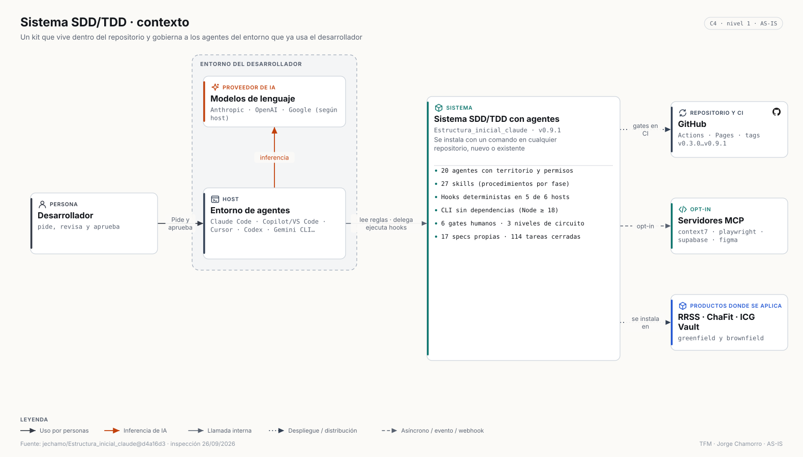

# 3 · Arquitectura global

El TFM tiene dos planos que conviene no mezclar:

1. **Plano de ingeniería**: el sistema SDD/TDD, que vive dentro de cada repositorio y gobierna a los agentes del IDE.
2. **Plano de producto**: la arquitectura en ejecución de RRSS Studio, ChaFit e ICG Vault.

Los agentes del sistema **no se ejecutan dentro de los productos**: trabajan sobre su código, su base de datos (por MCP, en ChaFit) y su documentación.

## Plano de ingeniería

El kit se instala con `npx github:jechamo/Estructura_inicial_claude init <ruta> --mode auto` (greenfield, brownfield o automático). Aporta un router operativo, 20 perfiles de agente con adaptadores para seis entornos, 27 skills, hooks deterministas, una CLI sin dependencias y gates en Git y CI. Detalle: [06 · Sistema de agentes](06-agentic-system.md).

## Plano de producto

| | RRSS Studio | ChaFit | ICG Vault |
|---|---|---|---|
| Estilo | Monolito modular local | SPA + BaaS + serverless | SPA + BaaS + serverless con lógica en SQL |
| Cliente | React 19 · Next.js 15 (App Router) | React 18 · Vite · Capacitor 8 | React 18 · Vite · Capacitor 8 |
| Servidor | Route Handlers en un proceso Node | 28 Edge Functions (Deno) | 35 Edge Functions (Deno) + 175 RPC |
| Datos | SQLite + ficheros + Vault | Postgres 17 (47 tablas) + Storage + `pgmq` | Postgres 17 (88 tablas) + Storage + `pg_cron` |
| IA | Claude Code CLI · Gemini · fal.ai · HeyGen · ElevenLabs · Whisper local | OpenAI (texto, visión, imagen, voz, asistente) | OpenAI (imagen y editorial) |
| Despliegue | Local (`127.0.0.1`), CI en Windows 11 | Vercel + Supabase + App Store + Google Play | Vercel + Supabase + App Store + Google Play |

Arquitectura detallada de cada uno: [RRSS](architecture/rrss-architecture.md) · [ChaFit](architecture/chafit-architecture.md) · [ICG Vault](architecture/icgvault-architecture.md). Integraciones y IA en conjunto: [integraciones](architecture/external-integrations.md) · [IA](architecture/ai-integrations.md).

### Contenedores lado a lado

| RRSS Studio | ChaFit | ICG Vault |
|---|---|---|
|  |  |  |

## Patrones que se repiten

- **Claves solo en el servidor.** En ChaFit e ICG Vault los secretos viven en Edge Functions; en RRSS, en un Vault cifrado local. El cliente nunca ve una API key de pago.
- **Trabajos largos asíncronos.** ChaFit genera rutinas con `job_id` y *polling*; RRSS emite progreso por SSE; ICG Vault programa retos con `pg_cron`.
- **Contratos validados en la frontera de la IA.** ChaFit exige JSON Schema estricto y rechaza respuestas truncadas; RRSS valida el JSON de la CLI; ICG Vault normaliza el JSON de quiz y encuestas.
- **Una SPA, tres plataformas.** ChaFit e ICG Vault comparten el mismo *bundle* para web, iOS y Android con Capacitor, con puerta de versión mínima para las apps publicadas.

## Fronteras de confianza

| Frontera | RRSS | ChaFit / ICG Vault |
|---|---|---|
| Usuario ↔ sistema | loopback, sin cuentas | Supabase Auth (JWT) + RLS |
| Sistema ↔ IA | sesión local de Claude Code; API keys en Vault | `OPENAI_API_KEY` en secretos de Edge Functions |
| Sistema ↔ terceros | HTTPS desde el proceso local | HTTPS desde Edge Functions; Mapbox, Sentry e identidad desde el cliente |
| Pruebas | guarda de salida: solo loopback | sin red de pruebas equivalente (hallazgo de auditoría) |

Detalle en [seguridad](security/security.md).
