# Metodología SDD con agentes

## 1. El circuito

```mermaid
flowchart LR
    K["Constitución<br/>principios innegociables"] --> SP["Especificar<br/>qué y porqué"]
    SP --> CQ["Aclarar<br/>clarifications.jsonl"]
    CQ -->|"preguntas material<br/>sin resolver"| SP
    CQ --> PL["Planificar<br/>plan · diseño · ADR"]
    PL --> CH["Listas de control<br/>calidad del requisito"]
    CH --> TK["Tareas<br/>agente + skill + run_id"]
    TK --> TDD["TDD<br/>rojo → verde → refactor"]
    TDD --> CV["Convergencia<br/>spec = código = evidencias"]
    CV --> RV["Revisión<br/>seguridad · calidad · code review"]
    RV --> RL["Release<br/>GO / NO-GO"]
```



- **La especificación define el qué y el porqué** antes de fijar el cómo.
- **Las listas de control** comprueban la calidad del requisito, y **las pruebas** comprueban el comportamiento.
- **Convergencia**: si el código se aparta de la spec, se actualiza una de las dos y se deja constancia de por qué.

## 2. Roles (agentes)

| Rol | Responsabilidad |
|---|---|
| `sdd-orchestrator` | Única entrada principal. Mantiene el objetivo, los permisos, las dependencias y el estado, y hace la síntesis. |
| `product-discovery` | Problema, usuarios, propuesta de valor y métricas. |
| `requirements-analyst` | Requisitos verificables y criterios de aceptación. |
| `solution-architect` | Compara alternativas y redacta los ADR. |
| `ux-accessibility` | Flujos, wireframes y accesibilidad. |
| `backend-engineer` / `frontend-engineer` / `data-engineer` | Implementación por capa. |
| `qa-tdd-engineer` | Pruebas primero y estrategia orientada al riesgo. |
| `security-engineer` | Modelado de amenazas, secretos y permisos. |
| `platform-sre` | Operación, SLO, runbooks e incidentes. |
| `code-reviewer` | Revisión independiente. |
| `release-governance` | Decisión GO / NO-GO. |

## 3. Handoffs: el contrato de delegación

Cada delegación se materializa con `sdd.py work start` como un fichero **inmutable** en
`specs/NNN-*/handoffs/`:

```text
objetivo · resultado esperado · incluido · excluido · rutas · decisiones previas
restricciones · permisos (read/write/execute) · prohibiciones · criterios de aceptación
checks de entrega · evidencias exigidas · perfil de modelo (fast|balanced|deep|inherit)
```

El cierre (`work complete`) exige ficheros tocados, checks ejecutados, resultado y ruta de la evidencia.

## 4. Niveles de verificación

| Nivel | Significado |
|---|---|
| `observed` | Los hooks `SubagentStart` y `SubagentStop` asociaron un subagente real a la tarea. |
| `observed-start` | Se observó el arranque; el cierre se acredita con checks y evidencias. |
| `declared-direct` | El rol activo trabajó directamente, sin delegar. |
| `legacy-recorded` | Ejecución histórica importada con procedencia completa. |
| `unverified-approved` | Limitación documentada. **No supera el modo estricto.** |

`python tools/sdd.py check --strict` rechaza cualquier tarea `done` sin una ejecución coherente.

## 5. Aplicación en cada proyecto

### RRSS Studio (greenfield)

- Documentos aprobados en orden: [requisitos](https://github.com/jechamo/rrss-automation-app/blob/main/docs/01-requisitos.md) → [diseño](https://github.com/jechamo/rrss-automation-app/blob/main/docs/02-diseno.md) → [arquitectura](https://github.com/jechamo/rrss-automation-app/blob/main/docs/03-arquitectura.md).
- 15 decisiones cerradas con el usuario (D-01 a D-15) antes de escribir código, y dudas abiertas (DA-xx) resueltas y documentadas.
- Implementación **requisito a requisito**, con validación del usuario entre uno y otro.
- *Quality gates* declarados en `.sdd/`: sdd, lint, typecheck, test, build, security, deps-audit y e2e.
- 30 skills del ecosistema y 3 de dominio (`rrss-lead-research`, `rrss-viral-analysis` y `rrss-content-generation`), que carga también el motor *headless* de la app.

### Chafit360 (brownfield)

- `docs/architecture/CURRENT-STATE.md` separa **lo observado** de **lo inferido** y prioriza riesgos.
- Constitución y dos ADR.
- Siete specs con spec, diseño, plan, modelo de datos, plan de pruebas y evidencias:

| Spec | Tema |
|---|---|
| 001 | Contrato canónico de 9 columnas para rutinas generadas por IA |
| 002 | Pipeline durable de miniaturas (WebP, PGMQ, Cron) |
| 003 | Vercel + Sentry sin modificar RLS |
| 004 | Alternativas con mancuernas y notas personales |
| 005 | Tags multimodales, días y JSON de rutinas |
| 006 | Sustitución de ejercicios por el cliente (con IA) |
| 007 | Ejecución por deslizamiento y marcas de cambio |

- Bitácora de decisiones append-only, con alternativas descartadas y **deuda aceptada** explícita.

### ICG Vault (brownfield)

- Evolución por **ramas `claude/*` y pull requests** (96 integradas), con un cambio acotado por PR.
- Pilotos arriesgados **aditivos y reversibles** con un plan de rollback escrito ([`docs/DUELO_ROLLBACK.md`](https://github.com/jechamo/icgbolt/blob/main/docs/DUELO_ROLLBACK.md)).
- Configuración de IA (modelo y calidad por función) gobernada desde el panel de administración, no desde el código.
