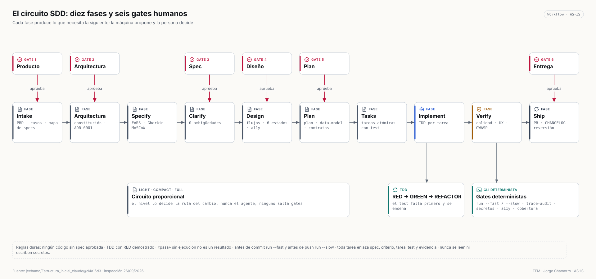

# 4 · Spec Driven Development

> Fuente vinculante: [`AGENTS.md`](https://github.com/jechamo/Estructura_inicial_claude/blob/main/AGENTS.md) y [`docs/sdd/OPERATING-MODEL.md`](https://github.com/jechamo/Estructura_inicial_claude/blob/main/docs/sdd/OPERATING-MODEL.md) del sistema.

## La regla que lo ordena todo

**Ningún código se implementa sin una spec aprobada en `docs/specs/NNN-slug/`.** La especificación es la fuente de verdad; el código es su consecuencia. Cada fase produce un artefacto durable en el repositorio que lee la siguiente, así la memoria del proyecto no depende del chat.

## Fases y artefactos

| Fase | Skill | Agente | Artefacto | Gate humano |
|---|---|---|---|---|
| Intake | `/sdd-intake` | orchestrator → spec-analyst ↔ ux-designer | `docs/product/` (PRD, casos de uso, mapa de specs) | 1 · Producto |
| Arquitectura | `/sdd-init` o `/onboard` | architect (+ research-analyst en brownfield) | `constitution.md`, ADR-0001, `CURRENT-STATE.md` | 2 · Arquitectura (solo greenfield) |
| Specify | `/sdd-specify` | spec-analyst | `spec.md`: requisitos EARS, criterios Gherkin, MoSCoW, impactos de seguridad, usabilidad y documentación | — |
| Clarify | `/sdd-clarify` | spec-analyst | `clarifications.md`, cero `[NEEDS CLARIFICATION]` | 3 · Spec |
| Design | `/sdd-design` | ux-designer | `design.md`: flujos, seis estados, accesibilidad | 4 · Diseño (si hay UI) |
| Plan | `/sdd-plan` | planner (+ consultores) | `plan.md`, `data-model.md`, `contracts/`, `research.md` | 5 · Plan |
| Tasks | `/sdd-tasks` | planner | `tasks.md`: tareas atómicas, cada una con su test | — |
| Implement | `/sdd-implement` + `/tdd` | implementer → especialistas | código + tests, `evidence.md` | — |
| Verify | `/sdd-verify`, `/security-scan` | code-reviewer, security-auditor (solo lectura) | informes parseables | — |
| Ship | `/sdd-ship` | release-manager | PR, CHANGELOG, plan de reversión | 6 · Entrega |

## Circuito proporcional: *light*, *compact*, *full*

No todo cambio necesita el mismo expediente, pero **ningún nivel se salta los controles**:

| Nivel | Cuándo | Qué exige |
|---|---|---|
| `light` | Un fichero exacto, aprobado y no ejecutable (una errata, un texto) | gates, *trailers* de commit y bitácora |
| `compact` | Conducta acotada en un solo módulo (≤ 3 criterios, 3 tareas, 12 KiB) | `change.md` sellado, TDD completo y revisión independiente |
| `full` | Seguridad, datos, API, dependencias, infraestructura, varios módulos o el propio SDD | expediente completo |

El nivel lo **decide la ruta del cambio**, no el agente: `check-sdd.mjs --circuit-status --planned <rutas>` clasifica contra una frontera aprobada por una persona en `.sdd/circuit.json`. Ante la duda, `full`.

## Qué hace verificable una spec

- **Requisitos EARS** ("CUANDO…, el sistema DEBE…") con prioridad MoSCoW sobre el esfuerzo.
- **Criterios Gherkin** que se convierten en tests.
- **Impactos declarados**: seguridad (`sensible` exige control → decisión → tarea → test → evidencia), usabilidad (WCAG 2.2 AA como suelo) y documentación.
- **Trazabilidad**: cada tarea terminada enlaza spec, criterio, tarea, test y evidencia ejecutada; `check-sdd --strict` falla si falta.

## Aplicación real

| Proyecto | Specs | Ejemplo |
|---|---:|---|
| Sistema SDD (sobre sí mismo) | 17 | spec 012 *"el sistema se aplica a sí mismo lo que exige a los demás"*; spec 016 añade cobertura SSRF |
| RRSS Studio | 18 requisitos + 2 specs del kit | REQ-001 análisis de app; spec 002 E2E sin red |
| ChaFit | 7 | spec 001 contrato de tablas de entrenamiento (ver [evidencia](evidence/implementation-evidence.md)) |
| ICG Vault | 0 aún; plan de corrección de la auditoría preparado para `/sdd-specify` | ver [caso de estudio](case-studies/icgvault.md) |
