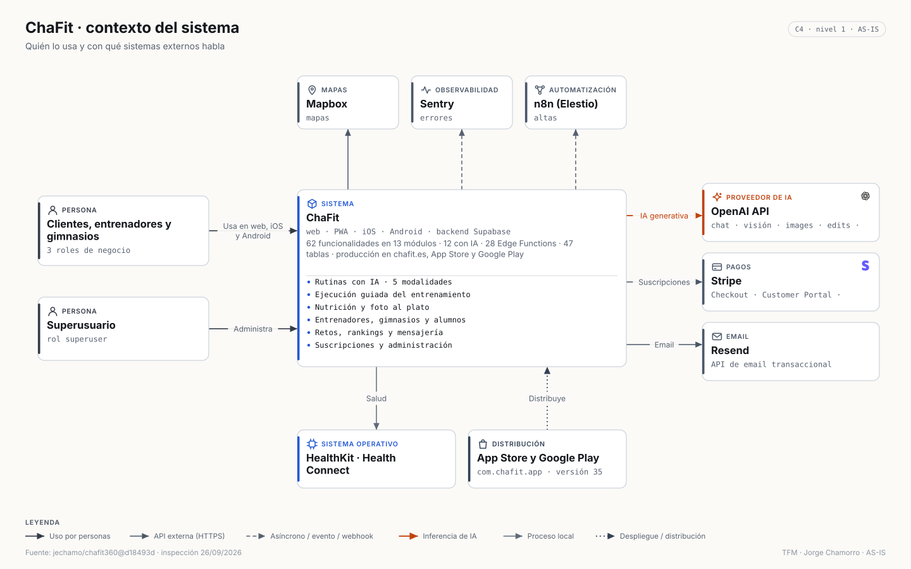
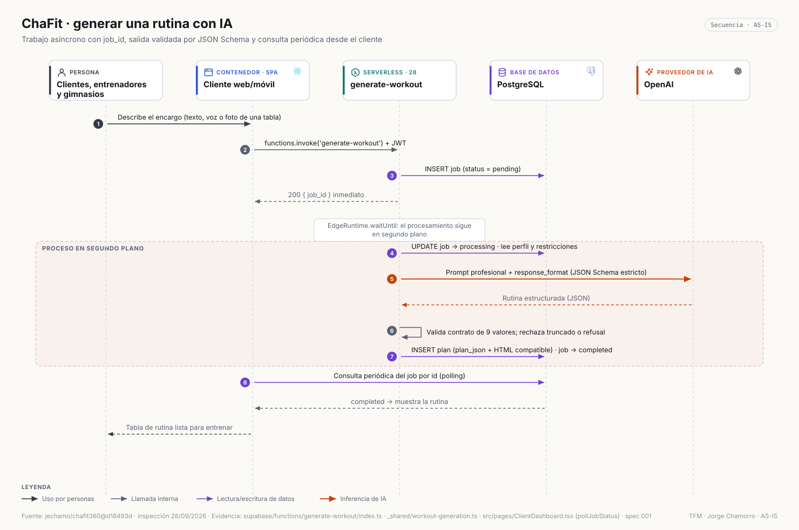
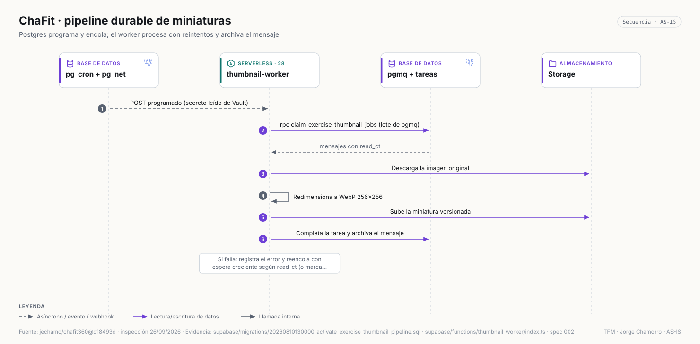
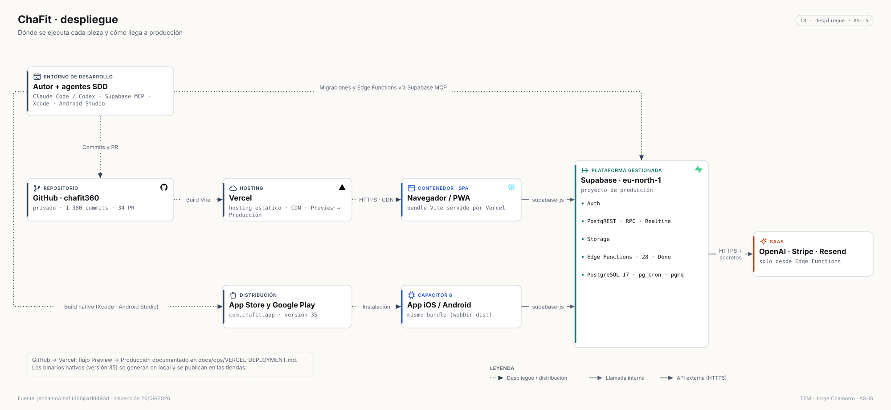

# ChaFit · Arquitectura (AS-IS)

> `jechamo/chafit360@d18493d` (release 35) · inspección 26/09/2026 · modelo: [`architecture/model/chafit.json`](../../architecture/model/chafit.json) · inventario con evidencias: [`CHAFIT_ARCHITECTURE_INVENTORY.md`](../discovery/CHAFIT_ARCHITECTURE_INVENTORY.md)

## 1. Resumen arquitectónico

Una **SPA React** única servida como web/PWA por Vercel y empaquetada con **Capacitor 8** para iOS y Android, conectada a un **proyecto Supabase**: Auth, PostgREST/RPC, Realtime, Storage y **28 Edge Functions (Deno)** sobre **Postgres 17** con RLS. Toda la IA (OpenAI), los pagos (Stripe) y el email (Resend) se ejecutan en Edge Functions con secretos de servidor.

## 2. Principales componentes

| Componente | Responsabilidad |
|---|---|
| Cliente web y móvil | Rutas por rol, ejecución guiada del entrenamiento, dietas, progreso, mapas, pagos |
| APIs del dispositivo | HealthKit/Health Connect, biometría, notificaciones locales, ficheros y compartir |
| Endpoint Supabase | Entrada única HTTPS/WebSocket (`/auth`, `/rest`, `/realtime`, `/storage`, `/functions`) |
| Edge Functions (28) | 7 de planificación, 3 de nutrición y progreso, 2 de conversación y voz, 7 de catálogo y miniaturas, 4 de comercio, 5 de administración y cuenta |
| PostgreSQL 17 | 47 tablas, RLS, funciones SQL, `pgmq`, `pg_cron`, `pg_net`, Vault |

## 3. Stack

React 18 · TypeScript · Vite 5 · Tailwind 3 · shadcn/ui (Radix) · React Router 6 · react-hook-form + zod · Recharts · Mapbox GL · Capacitor 8 (Preferences, LocalNotifications, Filesystem, Share) · Capgo NativeBiometric · cordova-plugin-health · Sentry (web + Capacitor) · Supabase JS 2 · Deno (Edge Functions) · Stripe SDK 14 · ImageMagick WASM · Playwright.

## 4. Fronteras del sistema

- **Dentro**: SPA, apps nativas, proyecto Supabase (datos, funciones, colas).
- **Fuera**: OpenAI, Stripe, Resend, Mapbox, Sentry, n8n, Vercel, tiendas, sistema operativo del móvil.
- **Frontera de confianza**: el dispositivo solo posee clave publicable y JWT; los secretos están en Edge Functions y en el Vault de Postgres.

## 5. Arquitectura frontend

- Enrutado en `src/App.tsx`: públicas (`/`, `/auth`, `/pricing`, `/privacy`, `/reset-password`) y protegidas por rol (`/gym`, `/trainer`, `/client/:id`, `/superuser`, `/my-workouts`, `/progress`, `/messages`, `/chat`, `/rankings`, `/search`, cuatro modos de ejecución).
- Paneles por rol con pestañas: cliente (*workouts, nutrition, challenges, rankings, friends*), entrenador (*clients, rankings*), gimnasio (*overview, trainers, clients, access, subscription-codes*), superusuario (9 pestañas).
- Estado: componentes y hooks propios; consulta directa a Supabase (TanStack Query instalado, apenas usado).
- Componentes grandes (`WorkoutExecution.tsx`, `ClientDashboard.tsx`) concentran estado y persistencia: deuda señalada por la auditoría.

## 6. Arquitectura backend

Serverless en Edge Functions con un *handler* compartido para las cinco modalidades de rutina (`_shared/workout-generation.ts`), resolución centralizada de modelos (`_shared/openai-models.ts`) y utilidades comunes de autenticación (`_shared/function-utils.ts`). Los trabajos largos devuelven `job_id` al instante y siguen con `EdgeRuntime.waitUntil`.

## 7. Persistencia

Postgres 17 gestionado: identidad y roles; gimnasios, entrenadores y clientes; rutinas (`plan_json` + HTML de compatibilidad), sesiones y registros; catálogo de ejercicios, imágenes, valoraciones y tags; dietas y comidas; mensajes, retos y rankings; suscripciones y códigos; configuración de IA y cupos. Storage: bucket `exercise-images`. Migraciones versionadas (52) con carpeta de *rollback*.

## 8. Autenticación

Supabase Auth con email y contraseña; registro por rol con códigos de gimnasio/entrenador; recuperación con redirecciones permitidas (`authRedirect.ts`, con test); sesión móvil persistida en Capacitor Preferences; desbloqueo biométrico opcional en nativo.

## 9. Seguridad

RLS activado en todas las tablas; secretos solo en servidor; saneado de HTML con DOMPurify; Sentry con `sendDefaultPii: false`, *beforeSend* y consentimiento; consentimiento explícito antes de enviar datos a IA. La auditoría del 23/09 identificó políticas y permisos a endurecer en la capa de datos y en varias funciones: ver [resumen saneado](../audits/chafit-audit-summary.md).

## 10. Servicios externos

Supabase, OpenAI, Stripe, Resend, Mapbox, Sentry, n8n, Vercel y HealthKit/Health Connect (**9**), más App Store y Google Play para distribución. Matriz completa: [`CHAFIT_INTEGRATIONS.md`](../discovery/CHAFIT_INTEGRATIONS.md).

## 11. IA

OpenAI desde Edge Functions en **12 funcionalidades**: rutinas (5 modalidades) con JSON Schema estricto, modificación, cambio de ejercicio, dieta, foto al plato (visión), antes/después (visión), ficha de ejercicio, ilustraciones (`gpt-image-2.5-*` configurable por función), "tu máquina" (`images/edits`), transcripción (`whisper-1`) y asistente (Assistants API). Modelo y calidad configurables desde el panel de superusuario.

## 12. APIs externas

REST de OpenAI, SDK de Stripe, REST de Resend, Mapbox GL + Geocoding v5, SDK de Sentry, webhook HTTP de n8n y plugin nativo de salud.

## 13. Flujo de datos

1. El cliente consulta y escribe bajo RLS vía PostgREST; se suscribe a cambios vía Realtime.
2. Para IA/pagos/email invoca una Edge Function con su JWT; la función lee contexto de Postgres, llama al tercero con su secreto y persiste el resultado.
3. Las imágenes se generan en servidor, se guardan en Storage y un pipeline durable crea miniaturas:

## 14. Despliegue

Web en Vercel (Preview → Producción), backend en Supabase (eu-north-1), apps nativas compiladas en local y publicadas en las tiendas (versión 35). Migraciones y funciones desplegadas por los agentes mediante **Supabase MCP**, con respaldo y *rollback* ensayados (spec 001).

## 15. Principales decisiones

| Decisión | Registro |
|---|---|
| Mantener la arquitectura heredada de Lovable y evolucionarla por specs | ADR-0001 |
| Vercel + Sentry sin cambiar la autorización | ADR-0002 |
| Contrato de 9 columnas y `plan_json` con respaldo HTML para no romper apps publicadas | specs 001 y 005 |
| Tablas laterales para variantes y notas en lugar de ampliar el HTML | spec 004 |
| Pipeline durable de miniaturas con `pgmq` y reintentos | spec 002 |

## 16. Riesgos y limitaciones

Endurecimiento de permisos en datos y funciones (auditoría), componentes muy grandes, TypeScript no estricto, `lint` y `tsc` no utilizables aún como gate, plan de Supabase sin copias de seguridad con recuperación a un instante, adaptadores de *wearables* incompletos.

## 17. Evidencias

Inventarios: [funcional](../discovery/CHAFIT_FUNCTIONAL_INVENTORY.md) · [arquitectura](../discovery/CHAFIT_ARCHITECTURE_INVENTORY.md) · [integraciones](../discovery/CHAFIT_INTEGRATIONS.md). Vista interactiva: [`chafit-container.html`](../../architecture/exported/html/chafit-container.html).
