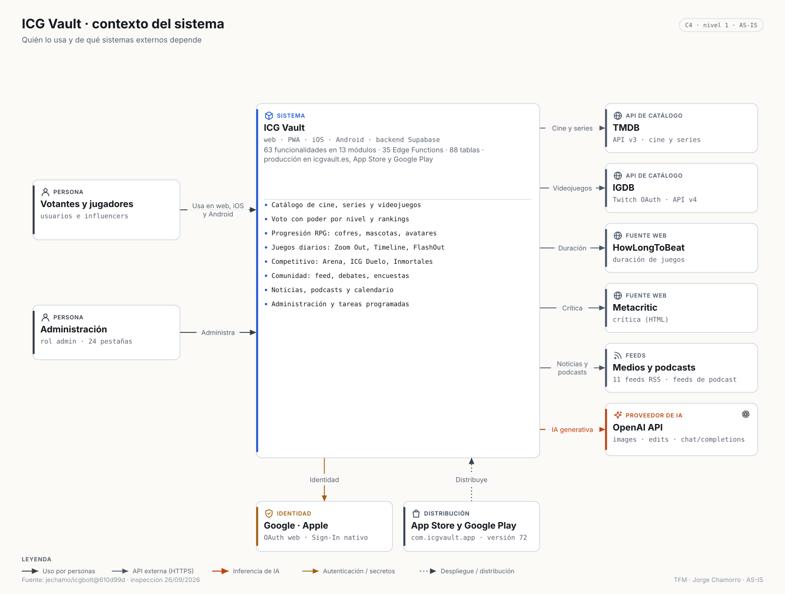
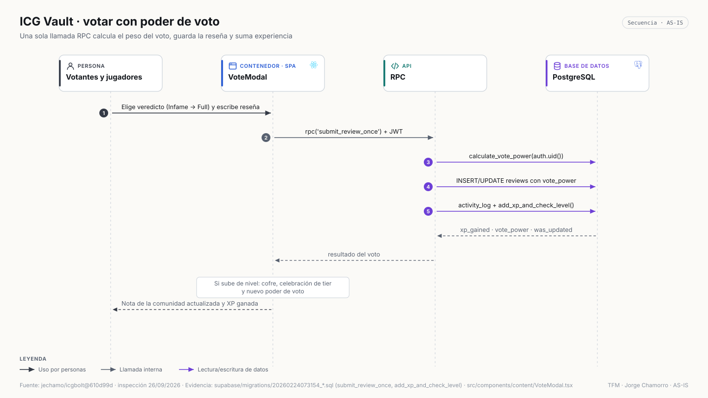
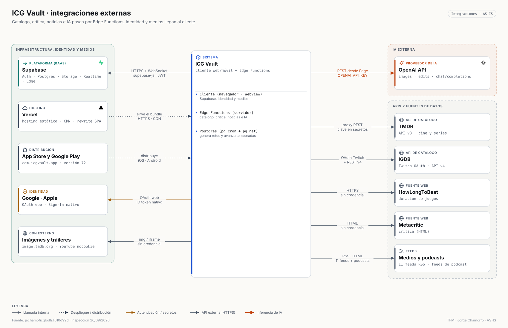
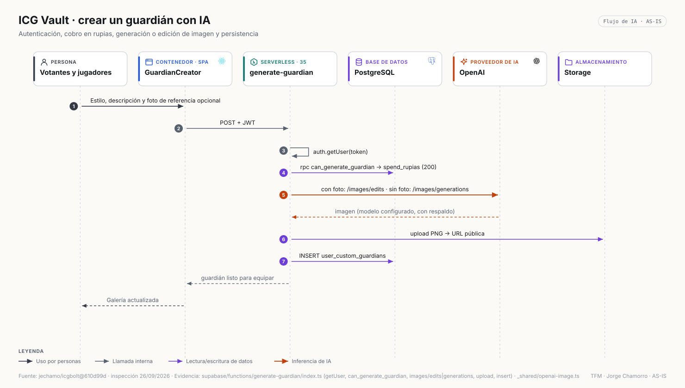
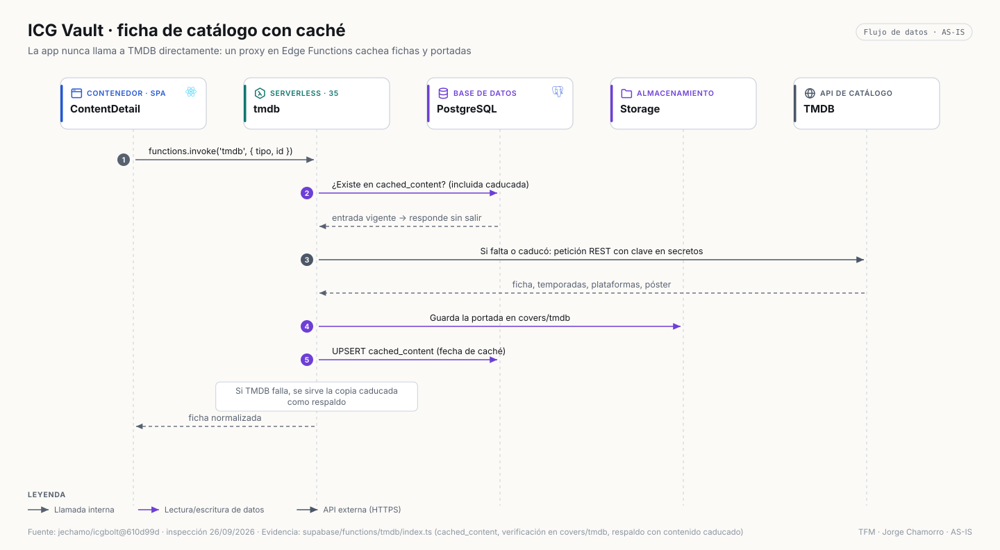
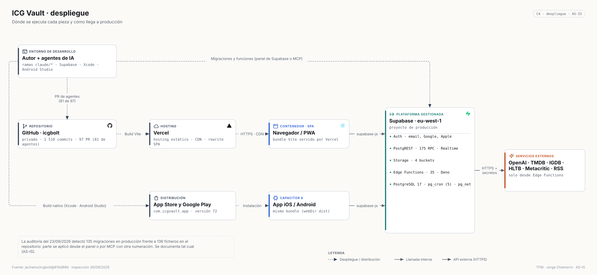

# ICG Vault · Arquitectura (AS-IS)

> `jechamo/icgbolt@610d99d` (versión 71; `main` en 72) · inspección 26/09/2026 · modelo: [`architecture/model/icgvault.json`](../../architecture/model/icgvault.json) · inventario: [`ICGVAULT_ARCHITECTURE_INVENTORY.md`](../discovery/ICGVAULT_ARCHITECTURE_INVENTORY.md)

## 1. Resumen arquitectónico

SPA React + Capacitor 8 (web/PWA, iOS, Android) sobre Supabase, con **la lógica de negocio mayoritariamente en SQL** (175 funciones RPC: voto ponderado, economía, cofres, experiencia, juegos) y **35 Edge Functions** como *proxies* de catálogo, generadores de IA y árbitros de partidas. `pg_cron` + `pg_net` automatizan retos y temporadas.

## 2. Principales componentes

| Grupo de Edge Functions | Funciones |
|---|---|
| Catálogo | `tmdb`, `igdb` |
| Enriquecimiento | `how-long-to-beat`, `metacritic` |
| Editorial | `fetch-news`, `article-reader`, `fetch-podcast-feed` |
| IA de imagen | `generate-avatar`, `generate-guardian`, `generate-item`, `generate-pet` |
| IA de texto | `generate-weekly-quiz`, `generate-weekly-survey` |
| Quiz | `submit-quiz-answer`, `complete-quiz` |
| Arena PvP | `pvp-create-match`, `pvp-join-match`, `pvp-submit-turn`, `pvp-simple-submit-turn`, `pvp-cancel-match` |
| ICG Duelo | `duelo-create-match`, `duelo-join-match`, `duelo-submit-move`, `duelo-mulligan`, `duelo-cancel-match`, `duelo-open-pack`, `duelo-grant-starter` |
| Cuentas | `delete-account`, `delete-relay-account`, `migrate-apple-identity` |
| Datos y automatización | `migration-export`, `migration-import`, `zoom-out-autopilot` |

## 3. Stack

React 18 · TypeScript · Vite · Tailwind · shadcn/ui · framer-motion · React Router 6 · TanStack Query (3 hooks) · html-to-image · Capacitor 8 (App, Browser, Filesystem, Share) · Capgo Social Login · plugin propio de detección de capturas · vite-plugin-pwa · Supabase JS · Deno.

## 4. Fronteras del sistema

Dentro: SPA, apps nativas y proyecto Supabase. Fuera: OpenAI, TMDB, IGDB/Twitch, HowLongToBeat, Metacritic, 11 medios RSS, feeds de podcast, YouTube, Google, Apple, Vercel, tiendas.

## 5. Arquitectura frontend

47 declaraciones de ruta con cuatro puertas: pública, `RequireAuth`, piloto (`RequireDueloPilot`, `RequireInmortalesPilot`) y `RequireAdmin`. `AppShell` coordina una cola de modales diarios (racha, mejores de la semana, novedades, tutoriales). Contextos globales: reproductor de audio persistente y cola de modales. Páginas grandes (`Admin.tsx`, `MyList.tsx`, `ContentDetail.tsx`, `Rankings.tsx`) con acceso directo a Supabase.

## 6. Arquitectura backend

- **SQL como dominio**: `submit_review_once` calcula el poder de voto, guarda la reseña, registra actividad y suma experiencia en una transacción; `open_chest_v2`, `add_xp_and_check_level`, juegos diarios (`*_get_today`, `*_submit_*`, *leaderboards*), Inmortales y sugerencias son RPC.
- **Edge Functions** para lo que exige secretos, red externa o arbitraje (PvP, Duelo).

## 7. Persistencia

Postgres 17 (88 tablas en el contrato; 92 en producción) agrupadas en identidad, catálogo y caché, valoración, biblioteca, economía RPG, progresión, social, editorial, encuestas, quiz, juegos diarios, PvP, Duelo, Inmortales, operación y soporte. Storage con 4 buckets. 136 migraciones versionadas.

## 8. Autenticación

Supabase Auth con email y nombre de usuario, Google (OAuth web) y Apple (ID token desde el SDK nativo); cuentas vinculadas y migración de identidad Apple; roles usuario, influencer y admin con multiplicadores.

## 9. Seguridad

RLS en todas las tablas; claves de catálogo e IA en secretos de Edge Functions; cobro en rupias verificado en servidor antes de generar imágenes; detección de capturas en Zoom Out. La auditoría del 23/09 prioriza restringir permisos y políticas en la capa de datos; ver [resumen saneado](../audits/icgvault-audit-summary.md).

## 10. Servicios externos

**12** en tiempo de ejecución + distribución. Detalle y matriz: [`ICGVAULT_INTEGRATIONS.md`](../discovery/ICGVAULT_INTEGRATIONS.md).

## 11. IA

OpenAI en 4 funcionalidades: avatar, guardián (con edición de foto de referencia), arte de objetos y mascotas, y borradores de quiz y encuestas. Modelos `gpt-image-2.5-sunburst`/`-flare` con cambio automático entre ellos ante indisponibilidad o *timeout*; `gpt-4o-mini` por defecto para texto.

## 12. APIs externas

TMDB API v3, IGDB API v4 con *client credentials* de Twitch, endpoints web de HowLongToBeat, HTML de Metacritic, RSS de medios y podcasts, lector de artículos, embeds de YouTube, OAuth de Google y Apple.

## 13. Flujo de datos

## 14. Despliegue

Web en Vercel; backend en Supabase (eu-west-1, plan con copias diarias según la auditoría); apps publicadas (versión 72 en `main`); 81 de las 97 PR proceden de ramas de agentes.

## 15. Principales decisiones

- Lógica transaccional de economía y juegos en SQL para reducir viajes de red y garantizar atomicidad.
- *Proxies* con caché en `cached_content` y portadas en Storage para no depender de la disponibilidad de TMDB.
- Puertas de piloto y configuración remota (versión mínima nativa, modo mantenimiento) para publicar funciones sin nueva versión en tiendas.
- Documentación de reversión de ICG Duelo (`docs/DUELO_ROLLBACK.md`).

## 16. Riesgos y limitaciones

Sin tests automatizados, componentes monolíticos, sin división de código, imágenes pesadas en `src/assets`, historial de migraciones desalineado con producción y endurecimiento de permisos pendiente (auditoría).

## 17. Evidencias

[Inventario funcional](../discovery/ICGVAULT_FUNCTIONAL_INVENTORY.md) · [arquitectura](../discovery/ICGVAULT_ARCHITECTURE_INVENTORY.md) · [integraciones](../discovery/ICGVAULT_INTEGRATIONS.md) · vista interactiva [`icgvault-container.html`](../../architecture/exported/html/icgvault-container.html).
