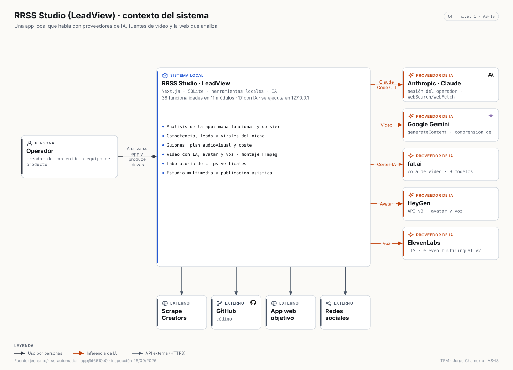
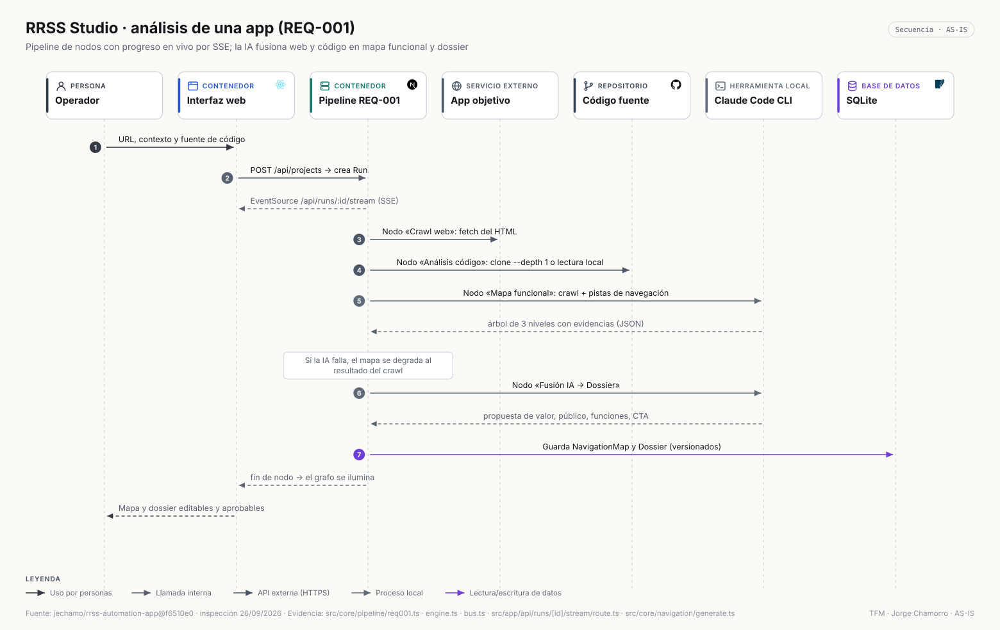
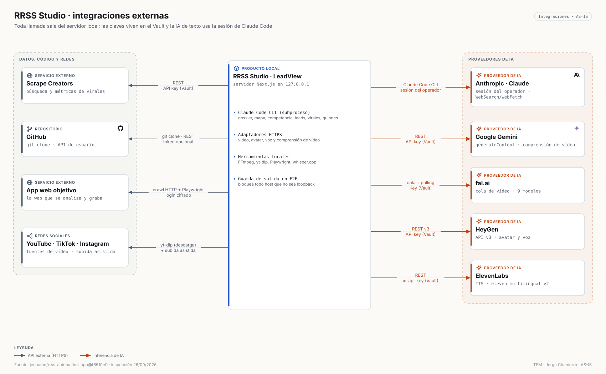
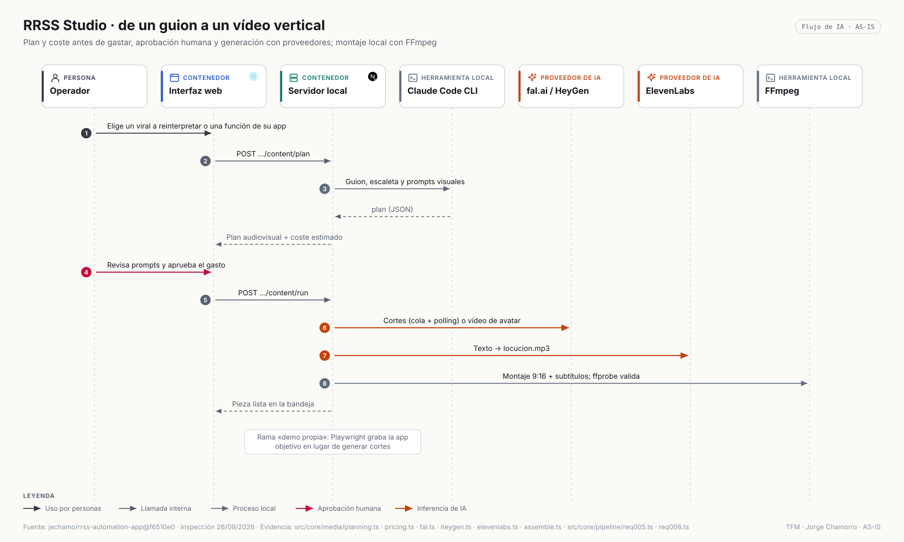
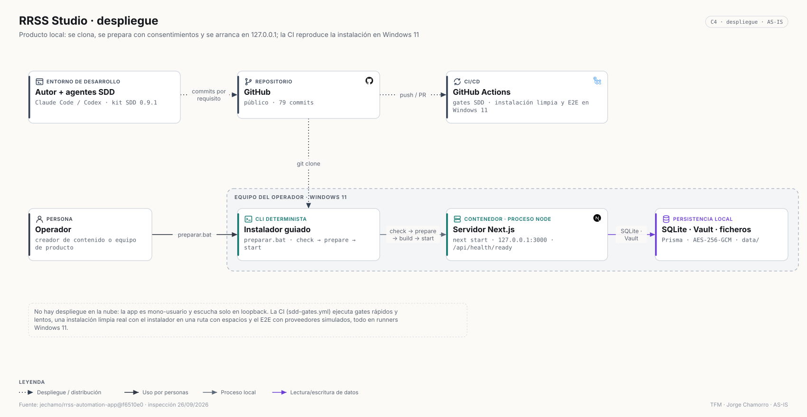

# RRSS Studio (LeadView) · Arquitectura (AS-IS)

> Copia local = `jechamo/rrss-automation-app@f6510e0` · inspección 26/09/2026 · modelo: [`architecture/model/rrss.json`](../../architecture/model/rrss.json) · inventario: [`RRSS_ARCHITECTURE_INVENTORY.md`](../discovery/RRSS_ARCHITECTURE_INVENTORY.md)

## 1. Resumen arquitectónico

**Monolito modular local**: un proceso Node (Next.js 15) sirve la interfaz y 52 *Route Handlers*, ejecuta los pipelines y orquesta IA y herramientas. SQLite (Prisma) + ficheros + Vault cifrado. Solo escucha en `127.0.0.1`.

## 2. Principales componentes

| Módulo de `src/core` | Responsabilidad |
|---|---|
| `pipeline` | motor de runs y nodos, bus de eventos, pipelines REQ-001…006 y remontaje |
| `crawler`, `repo`, `navigation`, `dossier` | análisis de la web y del código, mapa funcional, dossier |
| `competencia`, `leads`, `virales` | inteligencia de mercado |
| `content`, `media` | guiones, planificación, coste, adaptadores de proveedores, montaje, MIX |
| `clips` | laboratorio de clips: ingesta, selección, subtítulos, render, recuperación |
| `ai` | `AiEngine`: Claude CLI, Mock, Agent SDK (marcador) |
| `secrets`, `connectors`, `settings` | Vault, prueba de conectores, preferencias |
| `runtime`, `testing`, `health`, `installation` | perfil E2E, guarda de salida, *fakes*, *readiness*, instalador |

## 3. Stack

Node ≥ 20 · TypeScript · Next.js 15.5 (App Router) · React 19 · Tailwind 4 · React Flow (@xyflow/react) · Zustand · TanStack Query · zod · Prisma 6 + SQLite · Playwright · FFmpeg/ffprobe · yt-dlp · whisper.cpp · `@anthropic-ai/claude-code` · Vitest · Testing Library · ESLint.

## 4. Fronteras del sistema

Dentro: la máquina del operador (interfaz, servidor, datos, herramientas). Fuera: Anthropic (vía CLI), Gemini, fal.ai, HeyGen, ElevenLabs, Scrape Creators, GitHub, la web objetivo y las redes sociales.

## 5. Arquitectura frontend

Siete páginas (panel, nuevo análisis, proyecto, estudio multimedia, laboratorio de clips, ajustes, guía) y 36 componentes; `PipelineGraph` dibuja el pipeline con React Flow y se ilumina con eventos SSE.

## 6. Arquitectura backend

*Route Handlers* validan la entrada y lanzan casos de uso en proceso; cada pipeline es una lista declarativa de nodos con estado persistido en `Run`, reintento por nodo y progreso por un `EventEmitter` por ejecución expuesto como SSE.

## 7. Persistencia

11 modelos Prisma: `Project`, `NavigationMap`, `Dossier`, `Competencia`, `Leads`, `Virales`, `Run`, `ContentPiece`, `MediaAsset`, `MixComposition`, `ConnectorState`. Medios y trabajos de clips en `data/`. Configuración en JSON.

## 8. Autenticación

No hay cuentas: aplicación mono-usuario en loopback. Las credenciales que existen son **de terceros** (API keys y login de la app objetivo), cifradas en el Vault; la API nunca devuelve su valor.

## 9. Seguridad

Vault AES-256-GCM con IV aleatorio, *tag* de autenticación, escritura atómica y bloqueo; permisos mínimos para la CLI (`--allowedTools`); instalador con consentimientos por efecto que no mata procesos globales ni imprime secretos; guarda de salida en E2E; CI con `npm audit` y escaneo de secretos.

## 10. Servicios externos

**11** integraciones + 5 herramientas locales. Matriz: [`RRSS_INTEGRATIONS.md`](../discovery/RRSS_INTEGRATIONS.md).

## 11. IA

17 de 38 funcionalidades: texto por Claude Code CLI (dossier, mapa, competencia, leads con WebSearch/WebFetch, virales, guiones, demo), vídeo con fal.ai (9 modelos), avatar con HeyGen, voz con ElevenLabs, comprensión de vídeo con Gemini y transcripción local con whisper.cpp.

## 12. APIs externas

REST de Gemini, cola de fal.ai, REST v3 de HeyGen, REST de ElevenLabs, REST de Scrape Creators, `git clone` y API de GitHub, HTTP a la web objetivo, yt-dlp hacia YouTube/TikTok/Instagram.

## 13. Flujo de datos

Proyecto → crawl + código → mapa y dossier (Claude) → competencia, leads y virales → guion y plan con coste → aprobación → generación con proveedores → montaje FFmpeg → bandeja → publicación asistida.

## 14. Despliegue

## 15. Principales decisiones

| Decisión | Dónde |
|---|---|
| Un lenguaje y un proceso; local y mono-usuario | `docs/03-arquitectura.md` §1, ADR del kit |
| IA de texto con la sesión de Claude Code para no pagar API | D-02 en requisitos |
| Montaje local con FFmpeg, proveedores intercambiables | D-12 |
| Publicación asistida, nunca automática | REQ-010 |
| E2E sin red ni créditos | spec 002 |

## 16. Riesgos y limitaciones

Agent SDK sin implementar; pipelines que acceden directamente a Prisma (hexagonal pragmático, no estricto); bus de eventos en memoria (no durable); dependencia de la disponibilidad y tarifas de proveedores; clave del Vault en la misma máquina.

## 17. Evidencias

[Inventario funcional](../discovery/RRSS_FUNCTIONAL_INVENTORY.md) · [arquitectura](../discovery/RRSS_ARCHITECTURE_INVENTORY.md) · [integraciones](../discovery/RRSS_INTEGRATIONS.md) · vista interactiva [`rrss-container.html`](../../architecture/exported/html/rrss-container.html).
