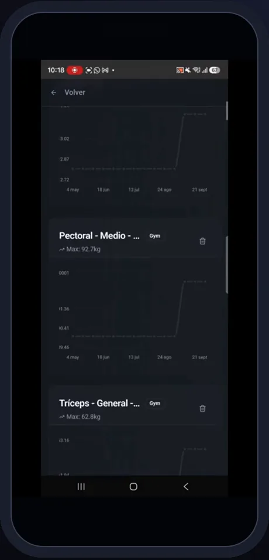
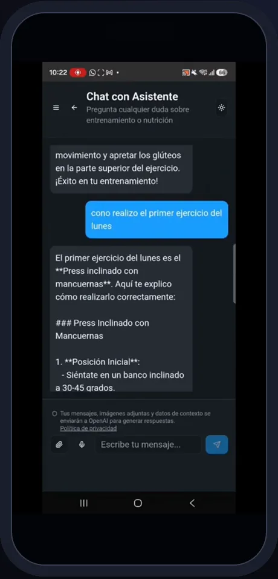

# ChaFit · Mapa funcional

> 13 módulos · 62 funcionalidades · 4 roles. Detalle fila a fila con evidencias en el [inventario funcional](../discovery/CHAFIT_FUNCTIONAL_INVENTORY.md).

## Actores y lo que puede hacer cada uno

| Actor | Panel | Pestañas / áreas | Lo esencial |
|---|---|---|---|
| **Cliente** | `ClientDashboard` | rutinas, nutrición, retos, rankings, amigos | pedir rutina y dieta con IA, entrenar guiado, foto al plato, progreso, chat |
| **Entrenador** | `TrainerDashboard` + `ClientDetail` | clientes, rankings | cartera de clientes, asignar rutinas/dietas/retos, zona de trabajo, código propio |
| **Gimnasio** | `GymDashboard` | resumen, entrenadores, clientes, accesos, códigos de suscripción | panel del centro, equipo, altas por código, cupos |
| **Superusuario** | `SuperuserDashboard` | resumen, límites, costes, retos, códigos, Stripe, modelos IA, demo, migración | gobierno de IA, cupos y catálogo |

## Módulos

| Módulo | Funcionalidades | IA | Integraciones | Móvil | Pantalla |
|---|---:|---|---|---|---|
| Acceso y cuenta | 7 | consentimiento previo | Supabase Auth, n8n | biometría nativa | — |
| Gimnasios | 4 | — | Mapbox, Stripe | sí |  |
| Entrenadores | 5 | — | Mapbox | sí |  |
| Rutinas con IA | 8 | rutinas (5 modalidades), modificar, cambiar ejercicio, voz | OpenAI | exportar/compartir Excel |  |
| Ejecución | 7 | — | — | aviso de descanso local |  |
| Catálogo de ejercicios | 6 | ficha, ilustración, "tu máquina" | OpenAI Images, Storage | cámara |  |
| Nutrición | 4 | dieta, foto al plato | OpenAI | cámara |  |
| Progreso | 3 | antes y después | OpenAI, HealthKit/Health Connect | salud nativa |  |
| Comunidad y motivación | 4 | — | Realtime | sí |  |
| Mensajería y asistente | 3 | asistente | OpenAI Assistants, Resend | sí |  |
| Suscripciones y pagos | 3 | — | Stripe | redirección |  |
| Administración | 6 | configuración de modelos, regenerar imágenes | OpenAI, Stripe | — | — |
| Plataforma | 2 | — | Sentry, PWA | web instalable | — |

## Flujos principales

1. **Rutina con IA** — el cliente describe el encargo (texto, voz o foto de una tabla) → `generate-*` crea un *job* → OpenAI con JSON Schema → contrato de 9 valores → plan listo → [secuencia](../../architecture/exported/svg/chafit-seq-routine.svg).
2. **Sesión guiada** — elegir día → calentamiento con cuenta atrás → ejercicio a ejercicio con foto, series, peso anterior y descanso → resumen y valoración del entrenador → retos verificados.
3. **Foto al plato** — foto → visión → ingredientes, kcal y macros → el cliente acepta → diario calórico.
4. **Entrenador** — cliente vinculado por código → ficha con objetivos y lesiones → rutina/dieta/retos asignados → mensajes.
5. **Gimnasio** — códigos de acceso → altas de entrenadores y alumnos → rendimiento del equipo → cupos de suscripción con Stripe.
6. **Miniaturas** — ilustración nueva → cola `pgmq` → worker programado → WebP → [secuencia](../../architecture/exported/svg/chafit-seq-thumbnails.svg).

## Qué mostrar

| Prioridad | Funcionalidades |
|---|---|
| **MUST SHOW** | rutina con IA por voz/foto, sesión guiada, "tu máquina", foto al plato, panel del entrenador, panel del gimnasio |
| **NICE TO SHOW** | antes y después, asistente, rankings multi-gimnasio, búsqueda de entrenador en mapa, códigos de acceso |
| **TECHNICAL EVIDENCE** | contrato de 9 columnas y migración con *rollback* (spec 001), pipeline durable de miniaturas, configuración de modelos por función, Sentry con consentimiento |
