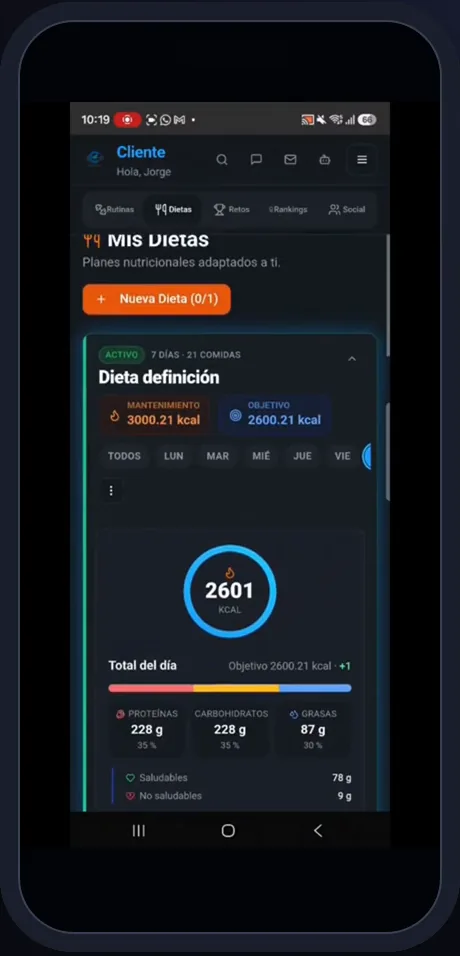
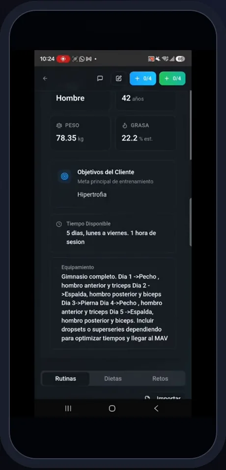
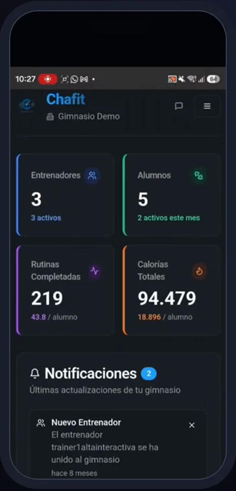
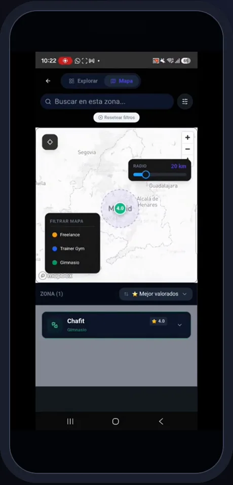
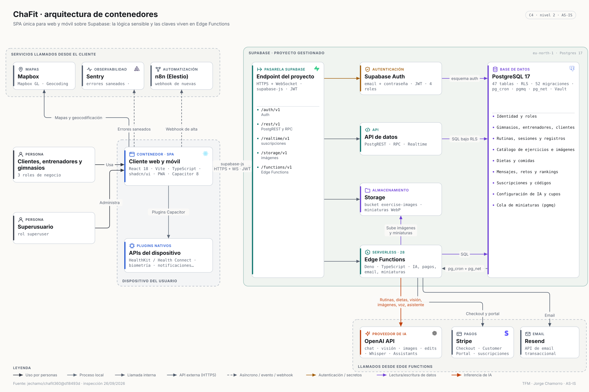

# Caso de estudio · ChaFit

> Producción: [chafit.es](https://chafit.es) · [App Store](https://apps.apple.com/app/chafit/id6759172876) · [Google Play](https://play.google.com/store/apps/details?id=com.chafit.app) · repositorio privado [`jechamo/chafit360`](https://github.com/jechamo/chafit360) (claves `.env` en el historial y auditoría completa; acceso para el tribunal) · release 35

## El problema

El entrenamiento personal está fragmentado: el cliente recibe la rutina en un PDF o una hoja de cálculo, apunta sus pesos en otra app, la dieta llega por otro canal y el entrenador no ve lo que pasa entre sesiones. Los gimnasios no tienen visibilidad del trabajo de sus entrenadores.

## La solución

Una plataforma única para los tres actores —**cliente, entrenador y gimnasio**, más un superusuario— con IA en los puntos donde aporta: generar rutinas y dietas a partir del perfil, explicar cada ejercicio con una ilustración de la máquina real, estimar las calorías de un plato con una foto y responder dudas con un asistente. Funciona en web, iOS y Android con el mismo código.

**13 módulos · 62 funcionalidades · 12 con IA · 9 integraciones externas.** [Inventario completo](../discovery/CHAFIT_FUNCTIONAL_INVENTORY.md) · [mapa funcional](chafit-functional-map.md)

## Lo que se ve en producción

| Entrenar | Dieta | Entrenador y gimnasio |
|---|---|---|
|  |  |  |
|  |  |  |
|  |  |  |

*Fotogramas del recorrido grabado por el autor sobre la app publicada (vídeo `chafit-4min`).*

## Arquitectura en una imagen

SPA React + Capacitor 8 sobre Supabase; 28 Edge Functions con los secretos de OpenAI, Stripe y Resend; Postgres 17 con RLS, `pgmq` y `pg_cron`. Detalle: [arquitectura](../architecture/chafit-architecture.md) · [integraciones](../discovery/CHAFIT_INTEGRATIONS.md).

## Relación con el sistema SDD/TDD

ChaFit es el caso **brownfield con especificaciones**: un producto nacido en Lovable, ya publicado y con usuarios, al que se aplicó el circuito completo.

| Spec | Necesidad | Resultado verificado | Commit |
|---|---|---|---|
| 001 · Contrato de tablas | La IA devolvía filas de 7 u 8 celdas y la app esperaba 9: descanso y comentarios desplazados | RED: 317 filas inválidas → GREEN: 437/437 filas de 9 celdas, 0 discrepancias frente al respaldo, calentamiento una sola vez por sesión; funciones desplegadas por MCP | `3965fcd` |
| 002 · Pipeline de miniaturas | Imágenes pesadas y sin reintentos | Cola `pgmq` + `pg_cron` + worker con reintentos y miniatura WebP 256×256 | `54722df` |
| 003 · Vercel y observabilidad | Salir de la plataforma de origen sin tocar la autorización | Vercel + Sentry con saneado y consentimiento (ADR-0002) | `6c58a10` |
| 004 · Alternativa con mancuernas y notas | La máquina está ocupada | Tablas laterales compatibles con las apps publicadas | `7637469` |
| 005 · Entrada multimodal, tags, días, `plan_json` | Pedir la rutina por voz o foto; reutilizar imágenes | Voz y adjuntos; tags; "tu máquina"; `plan_json` con respaldo HTML | `ab1afdc`, `bab1d89`, `51274ab`, `42f82f9` |
| 006 · Cambiar un ejercicio | El cliente quiere otra opción | Sustitución que conserva series y descanso | `1da5940` |
| 007 · Deslizar y marcar | Navegar la sesión sin bloquearse | Recorrido libre, marcas de cambio | `6b8f3e6` |

Además: 2 ADR, bitácora de decisiones y **auditoría integral** del 23/09 con 53 hallazgos que alimentan las specs 008–013 propuestas ([resumen saneado](../audits/chafit-audit-summary.md)).

## Calidad verificada hoy

`npm run test:unit:node` → **109/109**; `npm run test:unit:deno` → **100/100** (26/09/2026). Las pruebas E2E no se ejecutaron porque escriben datos.

## Qué demuestra en el TFM

Aplicar SDD y TDD **sobre producción real** sin romper las apps ya instaladas: contratos compatibles hacia atrás, migraciones con respaldo y *rollback* ensayados, despliegue por MCP con evidencia, y una auditoría que convierte la deuda en specs.
