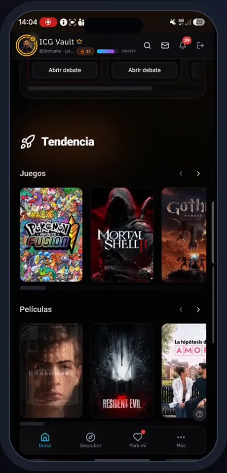
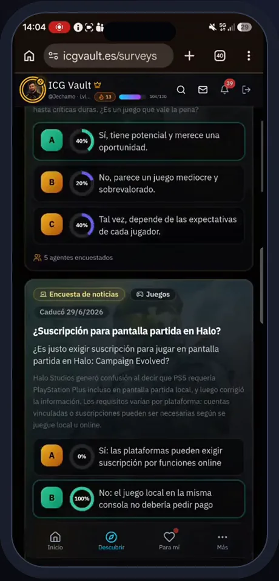
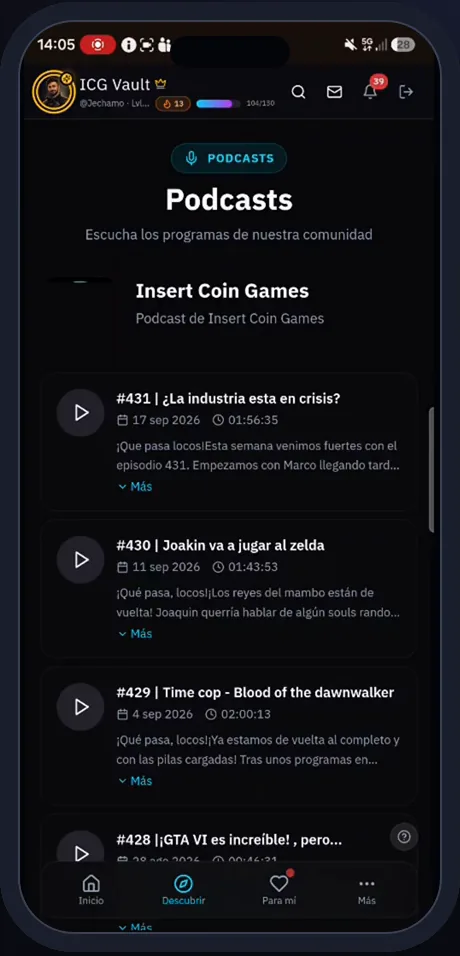

# ICG Vault · Mapa funcional

> 13 módulos · 63 funcionalidades · 3 roles + sistema programado. Detalle con evidencias en el [inventario funcional](../discovery/ICGVAULT_FUNCTIONAL_INVENTORY.md).

## Actores y superficies

| Actor | Acceso | Lo esencial |
|---|---|---|
| **Visitante** | `/bienvenida`, `/legal/*` | conocer el producto y registrarse (email, Google o Apple) |
| **Usuario** | 30+ rutas tras `RequireAuth` | votar, biblioteca, perfil RPG, juegos diarios, Arena, comunidad, noticias, podcasts |
| **Usuario piloto** | `RequireDueloPilot`, `RequireInmortalesPilot` | ICG Duelo e Inmortales |
| **Influencer** | rol con multiplicadores | mayor peso de voto y XP |
| **Administrador** | `/admin` (24 pestañas) | usuarios, catálogo RPG con IA, juegos, editorial con IA, operación, analítica |
| **Sistema** | 5 tareas `pg_cron` | genera retos, avanza temporadas, limpia partidas |

## Módulos

| Módulo | Funcionalidades | IA | Integraciones | Pantalla |
|---|---:|---|---|---|
| Acceso e identidad | 7 | — | Google, Apple |  |
| Catálogo y descubrimiento | 8 | — | TMDB, IGDB, HowLongToBeat, Metacritic, YouTube |  |
| Votación y reseñas | 7 | — | — |  |
| Biblioteca y listas | 2 | — | — |  |
| Rankings | 3 | — | — |  |
| Perfil y progresión RPG | 8 | avatar y guardián | OpenAI, Storage |  |
| Comunidad | 5 | — | Realtime |  |
| Noticias y podcast | 3 | — | 11 RSS, podcasts |  |
| Juegos diarios y quiz | 4 | — | plugin de capturas |  |
| Juegos competitivos | 5 | — | Realtime, `pg_cron` |  |
| Experiencia y avisos | 2 | — | Realtime | — |
| Administración y automatización | 7 | arte RPG, quiz y encuestas | OpenAI, `pg_cron` | — |
| Plataforma y distribución | 2 | — | Vercel, tiendas | — |

## Flujos principales

1. **Descubrir y votar** — buscar → ficha enriquecida (TMDB/IGDB + duración + crítica) → veredicto → poder de voto por nivel → nota de la comunidad → XP → [secuencia](../../architecture/exported/svg/icgvault-seq-vote.svg).
2. **Catálogo con caché** — ficha pedida al *proxy* → caché → tercero solo si falta → portada en Storage → [secuencia](../../architecture/exported/svg/icgvault-seq-catalog.svg).
3. **Progresión RPG** — XP y nivel → cofre → objetos y mascotas → rupias → avatar o guardián con IA → [secuencia](../../architecture/exported/svg/icgvault-seq-guardian.svg).
4. **Hábito diario** — Zoom Out, Timeline, FlashOut y quiz semanal, generados por tareas programadas, con rankings.
5. **Competición** — Arena PvP en tiempo real; ICG Duelo (mazos con cartas del catálogo); Inmortales (temporadas por eliminación con crónica).
6. **Comunidad** — seguir, feed, debates, encuestas, sugerencias votadas, noticias y podcasts.

## Qué mostrar

| Prioridad | Funcionalidades |
|---|---|
| **MUST SHOW** | ficha y voto con veredicto, poder de voto, cofres y equipamiento, avatar/guardián con IA, Zoom Out, Inmortales, multiplataforma |
| **NICE TO SHOW** | voto rápido, listas compartidas, lo mejor de la semana, debates y encuestas, podcasts, calendario de estrenos |
| **TECHNICAL EVIDENCE** | lógica transaccional en SQL, *proxies* con caché, `pg_cron` + `pg_net`, puertas de piloto y versión mínima nativa, cambio automático de modelo de imagen |
