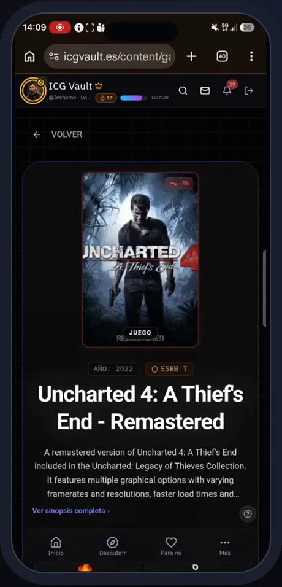
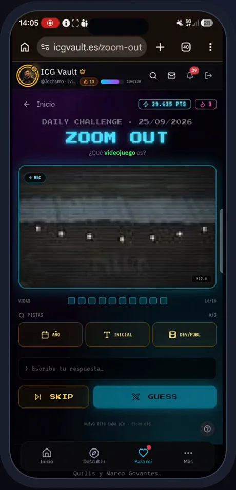
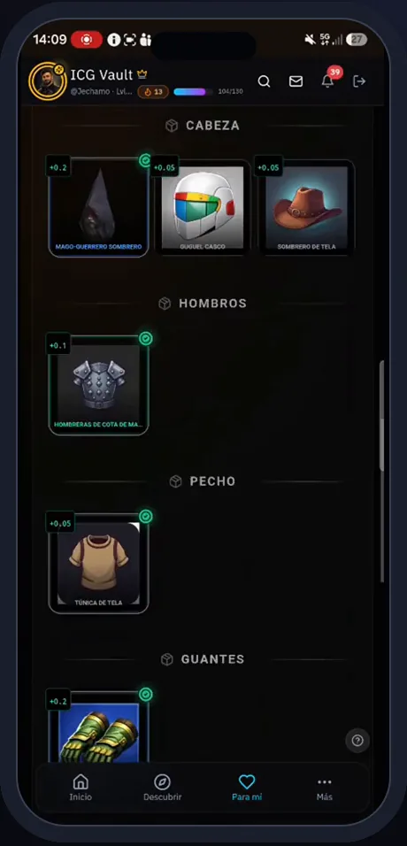
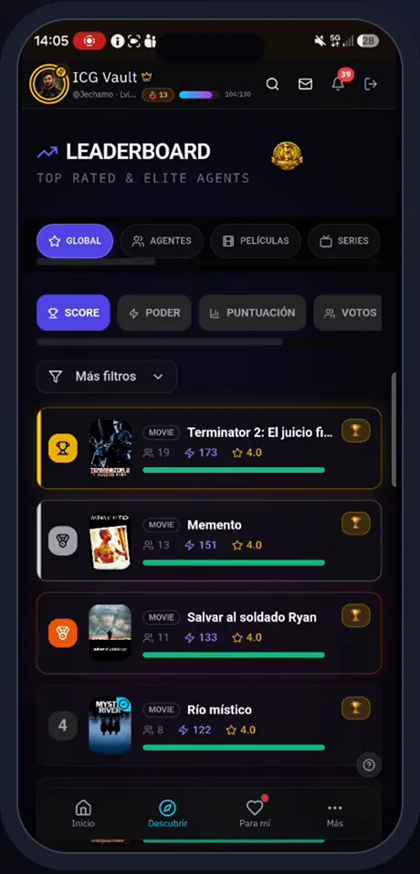
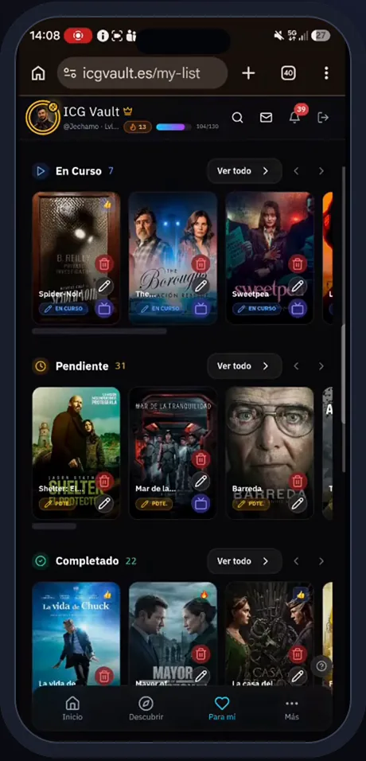
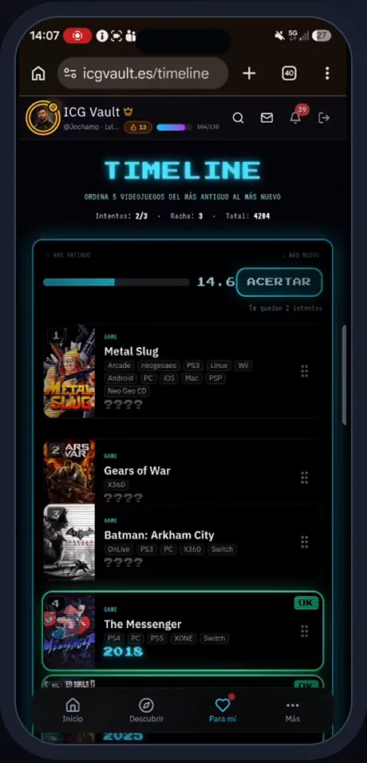

# Caso de estudio · ICG Vault

> Producción: [icgvault.es](https://icgvault.es) · [App Store](https://apps.apple.com/app/id6759173751) · [Google Play](https://play.google.com/store/apps/details?id=com.icgvault.app) · repositorio [`jechamo/icgbolt`](https://github.com/jechamo/icgbolt) · versión 72 en `main`

## El problema

Las notas de cine, series y videojuegos están repartidas en plataformas distintas y todas valen lo mismo: el voto de quien ha visto cien películas pesa como el de quien acaba de registrarse, y no hay motivo para volver cada día.

## La solución

**Una sola página para reunirlos a todos**: catálogo unificado de cine, series y videojuegos alimentado por TMDB e IGDB, un voto que **pesa más cuanto más nivel tienes**, una capa RPG (experiencia, cofres, equipo, mascotas, avatares y guardianes generados con IA) y juegos que dan motivos para volver: Zoom Out, Timeline, FlashOut, quiz semanal, Arena PvP, ICG Duelo (cartas) e Inmortales (temporadas por eliminación).

**13 módulos · 63 funcionalidades · 4 con IA · 12 integraciones externas.** [Inventario](../discovery/ICGVAULT_FUNCTIONAL_INVENTORY.md) · [mapa funcional](icgvault-functional-map.md)

## Lo que se ve en producción

| Catálogo y voto | Progresión RPG | Juegos y comunidad |
|---|---|---|
|  |  |  |
|  |  |  |
|  |  |  |

*Fotogramas del recorrido grabado por el autor sobre la app publicada (vídeo `icg-vault-4min`).*

## Arquitectura en una imagen

La lógica del juego vive en SQL (175 RPC) para ser transaccional; las 35 Edge Functions hacen de *proxy* con caché hacia los catálogos, generan imágenes con OpenAI y arbitran las partidas. Detalle: [arquitectura](../architecture/icgvault-architecture.md) · [integraciones](../discovery/ICGVAULT_INTEGRATIONS.md).

## Relación con el sistema SDD/TDD

ICG Vault es el caso **brownfield de escala**: el producto con más superficie (47 rutas, 38 páginas, 24 pestañas de administración) y el que mejor muestra dos usos del sistema distintos de "escribir una spec":

1. **Evolución por agentes con revisión humana.** Desde el 29/07/2026, 95 commits en `main`; **81 de las 97 PR** del repositorio proceden de ramas `claude/*` creadas por agentes y fusionadas por el autor. Ejemplo reciente: PR #97 (26/09) corrige un cofre duplicado al subir de nivel y excluye ediciones en Zoom Out, con la subida de versión nativa a 72.
2. **Auditoría integral con los agentes del sistema.** Sobre una copia con el kit instalado, el `orchestrator` coordinó a `security-auditor`, `code-reviewer` y `ux-designer` y contrastó sus hallazgos con consultas de **solo lectura** a la base de producción por MCP. Resultado: **48 hallazgos (16 críticos)** con evidencia, estándar OWASP asociado, corrección propuesta, *rollback* y un plan por fases que entra por `/sdd-specify` ([resumen saneado](../audits/icgvault-audit-summary.md)).

Lo que **no** se afirma: que ICG Vault se construyera con specs del sistema. No tiene expediente `docs/specs/` en `main`; la auditoría es precisamente la puerta de entrada para hacerlo.

## Qué demuestra en el TFM

Que el sistema sirve también para **entender y poner bajo control** un producto grande y vivo: inventario funcional exhaustivo, arquitectura real con sus desalineaciones (migraciones 135 vs 136), priorización de riesgos con evidencia y un camino de corrección reversible.
