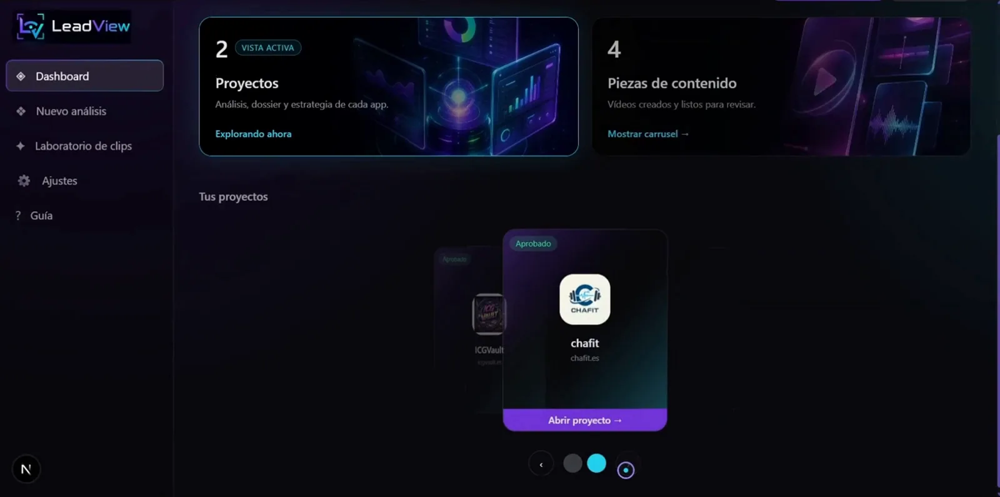
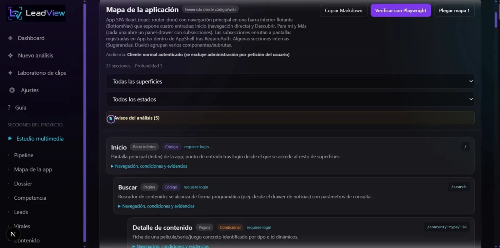
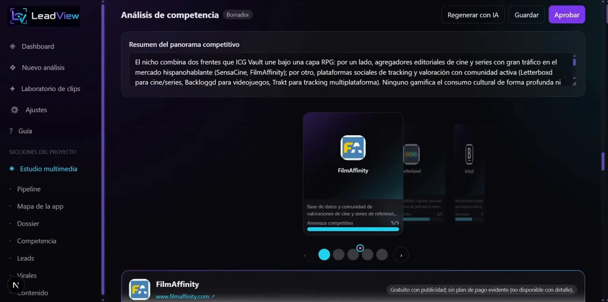
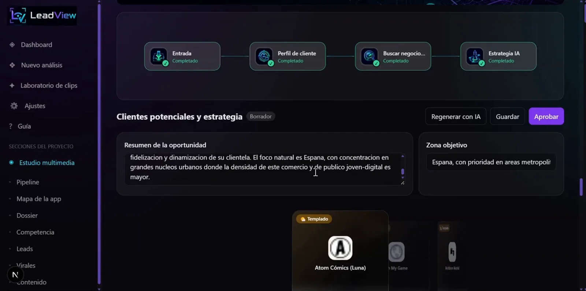
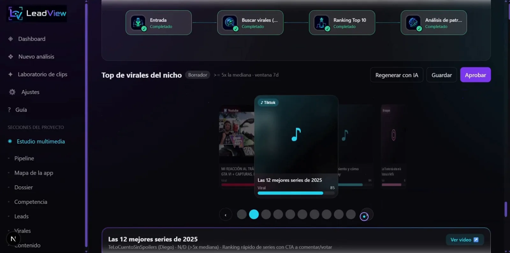
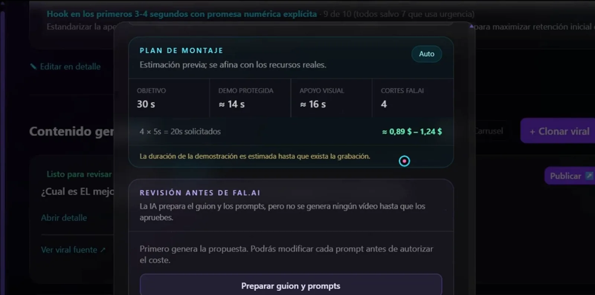
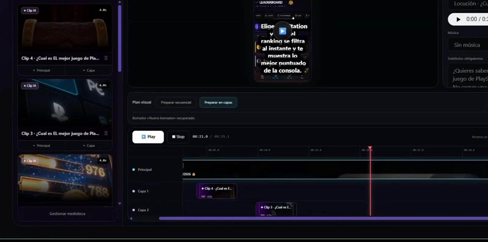
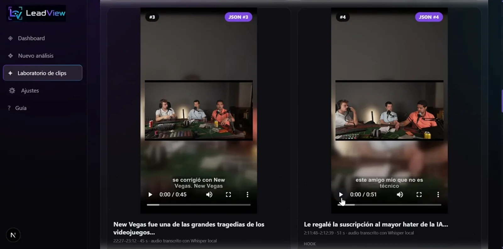
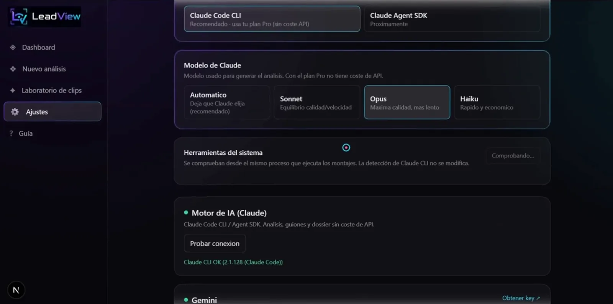

# RRSS Studio (LeadView) · Mapa funcional

> 11 módulos · 38 funcionalidades · un actor (operador) + el desarrollador en pruebas. Detalle con evidencias en el [inventario funcional](../discovery/RRSS_FUNCTIONAL_INVENTORY.md).

## Del producto al contenido

```text
Proyecto (URL + código + contexto)
   │
   ├─► Análisis de producto ── mapa funcional con evidencias · verificación con Playwright · dossier
   │
   ├─► Mercado ── competencia comparada · leads reales con estrategia · virales del nicho con patrones
   │
   └─► Producción ── guion ─► plan y coste ─► aprobación ─► vídeo IA / avatar / demo grabada ─► voz ─► montaje ─► bandeja ─► publicación asistida
                    └─► Estudio (mediateca, REC, MIX) · Laboratorio de clips (vídeo largo → clips 9:16 subtitulados)
```

## Módulos

| Módulo | Funcionalidades | IA | Integraciones | Pantalla |
|---|---:|---|---|---|
| Proyectos y panel | 4 | — | GitHub (opcional) |  |
| Análisis de producto | 6 | mapa y dossier (Claude) | web objetivo, Git, Playwright |  |
| Competencia | 2 | Claude | webs de competidores, logos |  |
| Leads | 3 | Claude + búsqueda web | Google Maps (embed) |  |
| Virales | 3 | Claude | Scrape Creators |  |
| Producción de contenido | 9 | guion, plan, vídeo, avatar, voz | fal.ai, HeyGen, ElevenLabs, Gemini, FFmpeg |  |
| Bandeja y publicación | 2 | — | YouTube, TikTok, Instagram (web) | — |
| Estudio multimedia | 3 | — | FFmpeg |  |
| Laboratorio de clips | 3 | Gemini, Whisper local | yt-dlp, FFmpeg |  |
| Ajustes y secretos | 2 | motor de IA | todos los proveedores |  |
| Operación y calidad | 1 | motor simulado | — | — |

## Qué mostrar

| Prioridad | Funcionalidades |
|---|---|
| **MUST SHOW** | alta de proyecto → pipeline en vivo → mapa con evidencias → dossier; competencia y leads; plan con coste y aprobación; vídeo final; laboratorio de clips |
| **NICE TO SHOW** | virales con patrones, estudio MIX, grabación automática de una demo, publicación asistida |
| **TECHNICAL EVIDENCE** | Claude Code CLI como motor con herramientas mínimas, Vault cifrado, E2E sin red, instalador con consentimientos, CI en Windows 11 |
