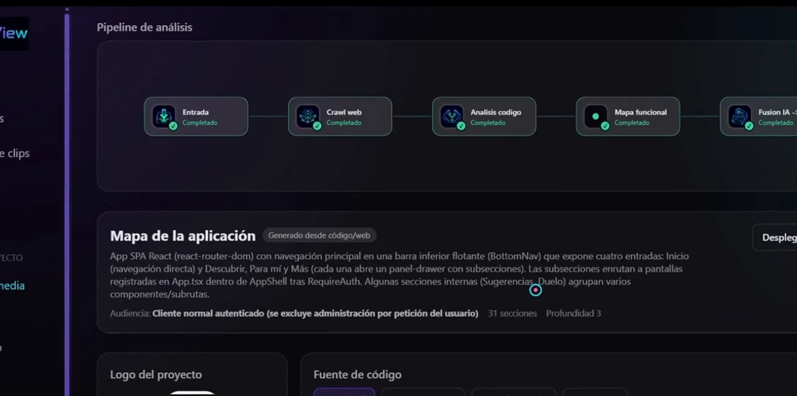
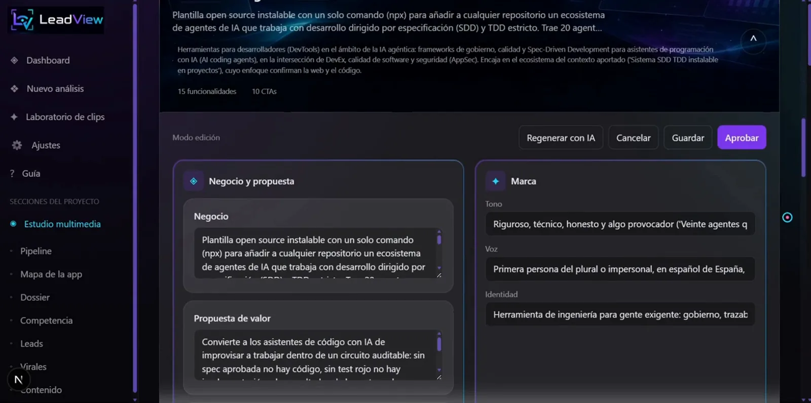

# Caso de estudio · RRSS Studio (LeadView)

> Repositorio público [`jechamo/rrss-automation-app`](https://github.com/jechamo/rrss-automation-app) · aplicación local (Windows 11) · en la interfaz se llama **LeadView**


## El problema

Publicar una app es la mitad del trabajo: después hay que entender el producto propio, saber contra quién compite, encontrar clientes y producir contenido que la gente quiera ver, todo sin un equipo de marketing.

## La solución

Una app local que **analiza un producto web desde su URL y su código** y produce, con IA: mapa funcional con evidencias, dossier de negocio, análisis de competencia, clientes potenciales reales con estrategia de captación, virales del nicho con sus patrones, y **vídeos verticales** —clonando el formato de un viral o grabando una demo de la propia app— con plan y coste previos, voz, avatar, montaje y publicación asistida.

**11 módulos · 38 funcionalidades · 17 con IA · 11 integraciones externas.** [Inventario](../discovery/RRSS_FUNCTIONAL_INVENTORY.md) · [mapa funcional](rrss-functional-map.md)

## Lo que se ve funcionando

| Análisis | Mercado | Producción |
|---|---|---|
|  |  |  |
|  |  |  |
|  |  |  |

*Fotogramas del vídeo `rrss-4min`. En la escena final, RRSS Studio analiza la plantilla del propio sistema SDD de este TFM.*

## Arquitectura en una imagen


Detalle: [arquitectura](../architecture/rrss-architecture.md) · [integraciones](../discovery/RRSS_INTEGRATIONS.md).

## Relación con el sistema SDD/TDD

RRSS es el caso **greenfield**: nació con el método.

```text
13/07  docs: requisitos v1 ─► diseño v1 ─► arquitectura v1        (antes de cualquier código)
13/07  feat: base Next.js ─► feat(REQ-001) análisis de appweb → dossier
…      REQ-002 … REQ-018  (commits etiquetados por requisito: 22 de REQ-001, 7 de REQ-011, 5 de REQ-012…)
21/08  chore(sdd): marco SDD/TDD v0.7.0
24/08  feat(REQ-001): instalación local endurecida con SDD 0.9.1
25–29/08  spec 001 bandeja + instalación · spec 002 E2E sin red ni créditos
```

| Evidencia | Qué prueba |
|---|---|
| `docs/01-requisitos.md` (REQ-001…018), `02-diseno.md`, `03-arquitectura.md` (aprobada v1) | especificación y arquitectura antes del código |
| `.sdd/installed.json` (kit 0.9.1, modo brownfield) | el sistema instalado sobre el proyecto |
| spec 002: 9/9 E2E, 71 Vitest, 138 contratos | TDD con evidencia; hoy reejecutado: 71 + 138 en verde |
| `sdd-gates.yml` con instalación limpia y E2E en Windows 11 | gates reproducibles en CI |
| `docs/04-bitacora.md` (983 líneas) | decisiones registradas |

## Qué demuestra en el TFM

Que el método sirve para construir **un producto nuevo con mucha IA** (17 de 38 funcionalidades) manteniendo control del gasto (plan y coste antes de generar, aprobación humana), pruebas sin red ni créditos y una instalación reproducible.
