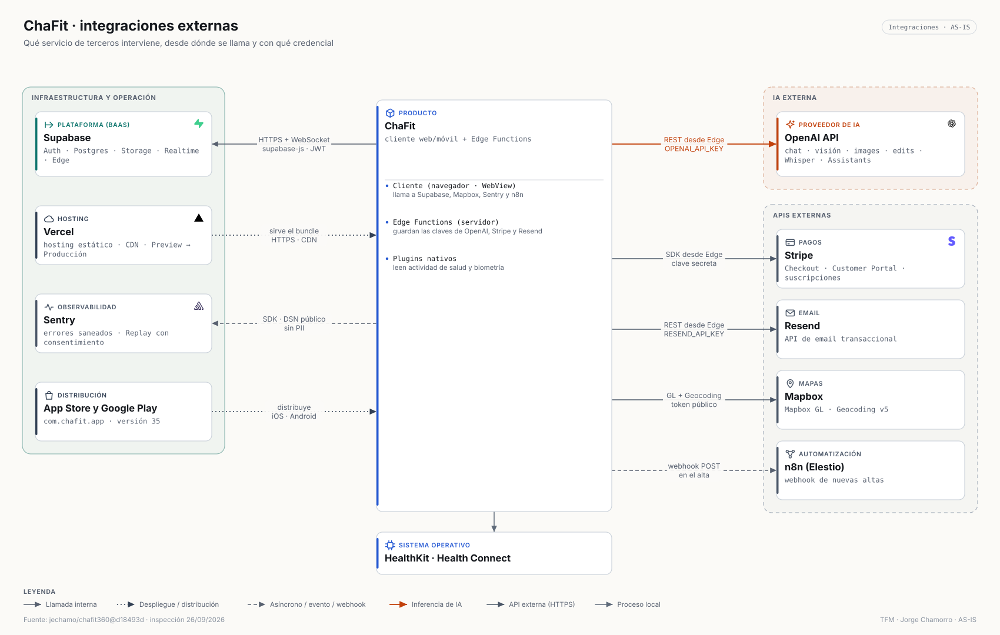

# ChaFit · Integraciones e IA

> `jechamo/chafit360@d18493d` · inspección de código 26/09/2026. No se ha llamado a ninguna API de producción ni se ha consumido cuota de IA, pagos o email para este inventario. Nunca se reproducen valores de secretos: solo el nombre de la variable.

**Criterio de recuento:** una integración externa es un servicio de terceros al que el sistema se conecta en tiempo de ejecución (API, SDK, OAuth, webhook o plugin de sistema operativo), contado por proveedor. Resultado: **9 integraciones externas en tiempo de ejecución** — Supabase, OpenAI, Stripe, Resend, Mapbox, Sentry, n8n, Vercel y HealthKit/Health Connect. La distribución por App Store y Google Play se documenta aparte (no es una conexión en ejecución).

## Plataforma: Supabase

| Servicio | Uso en ChaFit | Protocolo | Autenticación | Evidencia |
|---|---|---|---|---|
| Auth | Registro por rol, login, recuperación, JWT; sesión móvil en Capacitor Preferences | HTTPS (`/auth/v1`) | clave publicable + credenciales → JWT | `src/hooks/useAuth.tsx`, `src/utils/capacitorStorage.ts` |
| PostgREST + RPC | Todo el dominio (47 tablas) y funciones SQL de búsqueda, códigos, rankings y cupos | HTTPS (`/rest/v1`) | JWT + RLS | `src/integrations/supabase/types.ts` |
| Realtime | Mensajes, no leídos, retos, notificaciones del gimnasio, estado de suscripción (6 canales) | WebSocket | JWT | `src/pages/Messages.tsx` |
| Storage | Bucket `exercise-images` (ilustraciones y miniaturas) | HTTPS (`/storage/v1`) | lectura pública; escritura de servidor | `src/components/StorageManager.tsx` |
| Edge Functions | 28 funciones Deno con los secretos del servidor | HTTPS (`/functions/v1`) | JWT del usuario | `supabase/functions/` |
| `pg_cron` · `pg_net` · `pgmq` · Vault | Cola durable de miniaturas y su invocación programada | SQL / HTTP interno | secreto en Vault de Postgres | `supabase/migrations/20260810130000_activate_exercise_thumbnail_pipeline.sql` |

## Matriz de conexiones con terceros

<!-- BEGIN:gen:chafit-matrix -->
| Servicio | Tipo | Función | Desde | Hacia | Protocolo | Auth | Datos intercambiados | Evidencia |
|---|---|---|---|---|---|---|---|---|
| **OpenAI API** | IA | Texto, visión, imagen, edición de imagen, transcripción y asistente conversacional | Edge Functions | OpenAI API | HTTPS REST · síncrono | OPENAI_API_KEY (secreto de servidor) | perfil, encargo, fotos, audio → JSON, texto, imágenes | `supabase/functions/_shared/openai-models.ts` |
| **Stripe** | Pagos | Checkout, portal de cliente y estado de suscripciones | Edge Functions | Stripe | SDK stripe@14 sobre HTTPS · síncrono | clave secreta de Stripe | cliente, precio, suscripción | `supabase/functions/create-checkout/` |
| **Resend** | Email | Envío del formulario de contacto por email | Edge Functions | Resend | HTTPS REST · síncrono | RESEND_API_KEY | remitente, asunto, mensaje | `supabase/functions/send-contact-email/` |
| **Mapbox** | Mapas | Mapas y geocodificación para gimnasios, zonas de entrenador y búsqueda | Cliente web y móvil | Mapbox | HTTPS · Mapbox GL · síncrono | token público restringido | coordenadas, búsqueda de lugar | `src/components/maps/GymLocationPicker.tsx:129` |
| **Sentry** | Observabilidad | Captura de errores saneados y diagnóstico opcional con consentimiento | Cliente web y móvil | Sentry | SDK Sentry · asíncrono | DSN público | evento sin PII; Replay solo con consentimiento | `src/sentry.ts` |
| **n8n (Elestio)** | Automatización | Automatización externa que recibe las nuevas altas | Cliente web y móvil | n8n (Elestio) | HTTPS POST · asíncrono | URL no autenticada | datos del registro | `src/hooks/useAuth.tsx:264` |
<!-- END:gen:chafit-matrix -->

Además: **Vercel** sirve el *bundle* web (Preview → Producción, `docs/ops/VERCEL-DEPLOYMENT.md`); **HealthKit / Health Connect** se leen con `cordova-plugin-health` desde la app nativa; **App Store / Google Play** distribuyen `com.chafit.app` (versión 35).

## Inventario de IA

Proveedor único de inferencia: **OpenAI**, siempre desde Edge Functions (la clave nunca llega al cliente). El modelo de texto por defecto se resuelve en `_shared/openai-models.ts` y el de imagen se elige **por función desde el panel de superusuario** (tabla `ai_model_config`), con valor por defecto en código. **12 funcionalidades** del producto invocan un modelo.

| Uso | Modelo (configurado en código) | Endpoint / SDK | Origen → destino | Entrada | Salida | Configuración | Fallback | Control de coste | Seguridad | Evidencia |
|---|---|---|---|---|---|---|---|---|---|---|
| Rutina (5 modalidades) | `resolveTextModel` → `gpt-5.6-luna` por defecto | `/v1/chat/completions` con `response_format` JSON Schema | Cliente → `generate-*` → OpenAI | perfil, objetivos, restricciones, encargo, hasta 3 adjuntos | rutina estructurada (`plan_json` + HTML de 9 columnas) | alias heredados (`gpt-5-mini`) se reescriben al vigente | job asíncrono con estado `failed`; rechaza truncado o *refusal* | cupo de generaciones por cliente (`incrementUsage`) | JWT; consentimiento de IA previo | `_shared/workout-generation.ts`, spec 001 y 005 |
| Modificar rutina | `resolveTextModel` | `/v1/chat/completions` | Cliente → `modify-workout` → OpenAI | plan actual + instrucción | plan modificado | idem | contrato de 9 valores | cupo | JWT | `supabase/functions/modify-workout/` |
| Cambiar ejercicio | `resolveTextModel` | `/v1/chat/completions` | Cliente → `suggest-exercise-swap` → OpenAI | ejercicio y contexto | alternativas normalizadas | idem | filtra nombres inválidos y duplicados | — | JWT | `_shared/exercise-swap.ts` (+ test) |
| Dieta | `resolveTextModel` | `/v1/chat/completions` | Cliente → `generate-nutrition` → OpenAI | perfil nutricional, nº de comidas | plan por días con kcal y macros | idem | job con estado | cupo | JWT; consentimiento | `supabase/functions/generate-nutrition/` |
| Foto al plato | `ai_model_config` o `gpt-4o-mini` | `/v1/chat/completions` (visión) | Cliente → `analyze-meal-photo` → OpenAI | foto comprimida o texto; *detail* configurable | ingredientes, kcal, macros | modelo y detalle de visión desde el panel | valor por defecto si no hay fila | el usuario acepta antes de registrar | JWT | `analyze-meal-photo/index.ts:47` |
| Antes y después | `gpt-4o-mini` | `/v1/chat/completions` (visión) | Cliente → `analyze-progress` → OpenAI | dos fotos + contexto | análisis en JSON | fijo | respuesta estructurada de respaldo si falla el parseo | cupo de análisis | JWT | `analyze-progress/index.ts:134` |
| Ficha de ejercicio | `gpt-4o-mini` | `/v1/chat/completions` | Cliente → `get-exercise-details` → OpenAI | nombre del ejercicio | técnica, pasos, consejos, tags | fijo | reutiliza fichas existentes por *slug*/firma | evita regenerar | JWT | `supabase/functions/get-exercise-details/` |
| Ilustración del ejercicio | `ai_model_config` → `gpt-image-2.5-sunburst` / `-flare` | `/v1/images/generations` | Edge → OpenAI → Storage | prompt técnico del ejercicio | PNG → miniatura WebP | modelo y calidad por función | modelo por defecto si falta configuración | reutilización por tags; cupos mensuales | clave de servidor | `_shared/openai-models.ts:16`, `_shared/exercise-image-prompt.ts` |
| "Tu máquina" | `ai_model_config` | `/v1/images/edits` | Cliente → `generate-exercise-image-from-photo` → OpenAI | foto real de la máquina | ilustración con ese aparato | idem | conserva la original si falla | cupo de imágenes | JWT; prompt que preserva el aparato (test) | `_shared/machine-photo-prompt.ts` (+ test) |
| Regenerar ilustración (admin) | `ai_model_config` | `/v1/images/generations` | Panel → `regenerate-exercise-image` → OpenAI | prompt + instrucción | nueva imagen | idem | — | acción manual de superusuario | rol superusuario | `regenerate-exercise-image/index.ts:138` |
| Voz a texto | `whisper-1` | `/v1/audio/transcriptions` | Cliente → `transcribe-audio` → OpenAI | audio WebM | texto | fijo | error controlado | — | JWT | `transcribe-audio/index.ts:63` |
| Asistente conversacional | Assistant de OpenAI (modelo definido en el Assistant remoto) | Assistants API: `/v1/threads`, `/v1/files` | Cliente → `chat-assistant` → OpenAI | mensaje, contexto de rutina, adjuntos, voz | respuesta en conversación persistida | identificador de Assistant en código | — | cupo diario (`chat_daily_usage`) | JWT | `chat-assistant/index.ts:270` |

**Límites de lo que se afirma.** Los identificadores de modelo son los que figuran en el código; no se ha comprobado su disponibilidad comercial ni se han consumido créditos. El modelo efectivo del asistente depende de la configuración del Assistant en OpenAI. El simulador de costes del panel (`CostSimulator`) produce estimaciones, no facturación medida. La auditoría del 23/09/2026 señala controles de autorización y cupos a endurecer en estas funciones (ver [resumen saneado](../audits/chafit-audit-summary.md)).

Relacionado: [inventario de arquitectura](CHAFIT_ARCHITECTURE_INVENTORY.md) · [IA en los tres productos](../architecture/ai-integrations.md) · [integraciones de los tres productos](../architecture/external-integrations.md).
