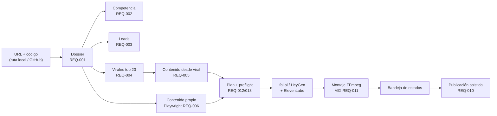

# RRSS Studio: automatización de contenido para redes sociales

**Repositorio:** [jechamo/rrss-automation-app](https://github.com/jechamo/rrss-automation-app) · **Tipo:** aplicación web local · **Proyecto principal del TFM**

## Qué es

Un estudio local que, a partir de la **URL y el código de una app web**, genera toda la cadena de
marketing en redes sociales: entiende el producto, estudia la competencia, encuentra clientes
potenciales, detecta vídeos virales del nicho, genera vídeos nuevos (clonando un formato viral o
enseñando la propia app) y los deja listos para publicar.

Se ha usado sobre los propios productos del TFM: ICG Vault y Chafit360 son proyectos dentro de RRSS Studio.

## Flujo principal

## Requisitos implementados

| REQ | Funcionalidad |
|---|---|
| 001 | Análisis de la app web: crawl HTTP + análisis de repositorio → dossier de negocio, marca y producto |
| 002 | Competencia con descubrimiento híbrido (IA + manual, lo manual se conserva al regenerar) |
| 003 | Leads locales reales con estrategia de captación editable (correo, visita con guion…) |
| 004 | Virales: IA + WebSearch, Scrape Creators o modo híbrido; viral = ≈5× la mediana del autor en 30 días |
| 005 | Clonado de viral: extracción → guion → fal.ai o HeyGen → ElevenLabs → montaje |
| 006 | Contenido propio: Playwright navega la app en modo móvil y graba la demo |
| 007 | Skills de dominio para el motor de IA |
| 008 | Ajustes con Vault cifrado y «Probar conexión» |
| 009 | Experiencia visual: tema oscuro/neón/glass, carrusel 3D y pipeline de nodos animado |
| 010 | Publicación asistida sin tokens de redes: descargar, copiar, abrir y marcar |
| 011 | Estudio multimedia: mediateca, grabación REC/STOP y MIX |
| 012 | Planificación audiovisual: número de cortes, segundos facturables y coste antes de generar |
| 013 | *Preflight* obligatorio de prompts y catálogo ampliado de modelos de fal.ai |
| 014 | Navegación autenticada fiable, sin contraseñas en prompts ni en logs |
| 015 | Mapa funcional recursivo de la app (3 niveles, referencias `archivo:línea`) |
| 016 | Pulido de navegación, reconexión SSE y login con Playwright |
| 018 | Laboratorio de clips: vídeo largo o YouTube → clips 9:16 virales y polémicos con subtítulos |

## Datos técnicos

- **Stack:** Next.js 15, React 19, TypeScript, Tailwind 4, React Flow, Zustand, React Query, Prisma + SQLite.
- **Tamaño:** unas 33.700 líneas en 208 ficheros TypeScript, 16 grupos de API y 11 modelos de datos.
- **IA:** Claude Code CLI o Agent SDK (seleccionable), Gemini (vídeo), fal.ai (vídeo generativo), HeyGen (avatar), ElevenLabs (voz) y Whisper local (transcripción).
- **Pruebas:** Vitest para la UI, contratos con `node --test` para el dominio y Playwright E2E con proveedores simulados y egreso bloqueado.
- **Seguridad:** Vault AES-256-GCM versionado y atómico, credenciales de la app analizada en un registro cifrado aparte, servidor limitado a `127.0.0.1` y escáner de secretos.
- **Instalación:** asistente guiado con diagnóstico, preparación, arranque y *readiness* real (aplicación, BD y Vault).

## Decisiones destacadas

| Decisión | Motivo |
|---|---|
| App local, no SaaS (D-01) | Acceso a ficheros, Playwright, FFmpeg y la sesión de Claude Code sin exponer credenciales de terceros. |
| Claude Code CLI como motor (D-02) | Sin coste de API con el plan del usuario; Gemini solo cuando hace falta entender vídeo. |
| Publicación asistida (D-06) | Sin tokens de APIs de redes y con control humano final. |
| Montaje *pluggable* (D-12) | FFmpeg local por defecto, con la puerta abierta a un proveedor en la nube. |
| Multiproyecto desde el modelo (D-14) | Escalar sin migraciones. |
